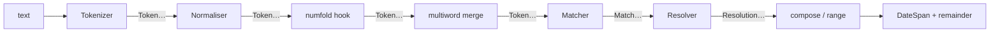

# Reading dates written by humans

The golden rule of this module: **turn "the 15th of Ramadan 1446" into a
span.** A person writes a date as a phrase — an ordinal, a month name from
whichever calendar they think in, a year — and `extract_timespan` turns
that phrase into the exact stretch of time it refers to.

```python
from chronologia import extract_timespan
from datetime import datetime

anchor = datetime(2024, 1, 1)   # what "now" means for relative phrases

span, remainder = extract_timespan("the 15th of Ramadan 1446", "en", anchor)
print(span.start_datetime.date())   # 2025-03-15
print(remainder)                    # the
```

The 15th of the Islamic month Ramadan in the Hijri year 1446 is the 15th
of March 2025 — computed, not looked up. The Islamic month name is read
straight from the English vocabulary; you do not have to tell the library
which calendar the phrase is in.

## What comes back

`extract_timespan(text, lang, anchor)` returns either `None` (nothing
matched) or a `(span, remainder)` pair:

- **`span`** is a [`DateSpan`](getting-started.md) — a half-open interval,
  *not* a single instant. A phrase names a stretch of time, and the span's
  **width** is that stretch. "June 2027" is a month wide; "3 pm" is a
  minute wide. This is the whole reason the function exists: it never
  invents a precision the speaker did not give.
- **`remainder`** is the leftover text the parse did not consume — the
  words around the date, so a caller can see what was and was not a date.

```python
from chronologia import extract_timespan
from datetime import datetime

june, _ = extract_timespan("june 2027", "en", datetime(2024, 1, 1))
print(june.width, "|", june.resolution.name)   # 30 days, 0:00:00 | MONTH

three_pm, _ = extract_timespan("3 pm", "en", datetime(2024, 1, 1))
print(three_pm.width)                           # 0:01:00
```

## The anchor

Relative phrases ("in three days", "next winter", "last tuesday") only mean
something relative to a moment. That moment is the `anchor` — pass the
caller's idea of "now"; it defaults to the wall clock.

```python
from chronologia import extract_timespan
from datetime import datetime

anchor = datetime(2017, 6, 27, 13, 4)   # a Tuesday

soon, _ = extract_timespan("in three days", "en", anchor)
print(soon.start_datetime)   # 2017-06-30 13:04:00

winter, _ = extract_timespan("next winter", "en", anchor)
print(winter.start_datetime.date())   # 2017-12-01
```

A range framed with "from A to B" or "between A and B" spans from the start
of the left endpoint to the end of the right one:

```python
from chronologia import extract_timespan
from datetime import datetime

span, _ = extract_timespan("from june 5th to june 12th", "en",
                           datetime(2017, 6, 27))
print(span.start_datetime.date(), "->", span.end_datetime.date())
# 2018-06-05 -> 2018-06-13
```

(June 5–12 is already past the June-27 anchor, so it rolls to the next
year — the engine prefers the future for bare calendar dates.)

Both endpoints resolve in the **same** frame: the future preference is
applied to the range as a whole, never to one endpoint alone. So a range
that *straddles* the anchor keeps both edges in the current cycle instead
of letting the left endpoint leap a year ahead of the right — spoken on
July 22, "from july 20 to july 25" is this year's July 20–25, not next
year's. A cross-year span like "from december 28 to january 3" simply rolls
the *end* into the following year so it never inverts. Any endpoint that
resolves to a date works — bare dates, dates with years, and holidays
("from christmas to new year's day") all compose, in dash form too
("july 20 - july 25").

**Open-ended ranges** name a single endpoint and pin the other edge to the
anchor ("now"). The named endpoint keeps the closed-range convention — the
*until* endpoint contributes its end (it is included in full, like the right
endpoint of "from A to B"), the *since* endpoint its start:

```python
extract_timespan("until friday", "en", datetime(2017, 6, 27, 13, 4))[0]
# [2017-06-27 13:04, 2017-07-01)  -- now through the whole of Friday
extract_timespan("since 2010", "en", datetime(2017, 6, 27, 13, 4))[0]
# [2010-01-01, 2017-06-27 13:04)  -- start of 2010 up to now
```

The `until`/`through` (open start) and `since` (open end) surfaces are
per-language range markers, so "bis freitag" / "seit 2010" (de), "jusqu'à
vendredi" / "depuis 2010" (fr), "até sexta-feira" / "desde 2010" (pt) and
"hasta viernes" / "desde 2010" (es) behave the same way.

## Deep time and other reckonings

Because the extractor resolves against the full reckoning core, it reaches
places `datetime` cannot. "66 million years ago" is a real span — its edges
are `AstroDate`, and `start_datetime` is simply `None` when a year falls
outside `datetime`'s range:

```python
from chronologia import extract_timespan
from datetime import datetime

span, _ = extract_timespan("66 million years ago", "en", datetime(2017, 6, 27))
print(span.start.year, span.resolution.name)   # -65998050 EPOCH_GEOLOGICAL
print(span.start_datetime)                      # None
```

## The week of a date, and decades before Christ

Two phrasings widen a date to the period a speaker really meant. **"the week
of <date>"** resolves the date inside it and returns the whole seven-day week
that contains it — aligned to the locale's `week_start` (Monday for the
languages that carry the marker). The marker itself ("the week of", Portuguese
"a semana de", German "die woche vom", French "la semaine du", ...) is a
per-language fact; the widening is generic, so it wraps *any* date the engine
already resolves:

```python
from chronologia import extract_timespan
from datetime import datetime

anchor = datetime(2017, 6, 27)
span, remainder = extract_timespan("the week of july 20 2026", "en", anchor)
print(span.start_datetime.date(), span.end_datetime.date())  # 2026-07-20 2026-07-27
print(span.width.days)                                        # 7

# same widening, driven only by each locale's own marker vocabulary
pt, _ = extract_timespan("a semana de 20 de julho de 2026", "pt", anchor)
de, _ = extract_timespan("die woche vom 20. juli 2026", "de", anchor)
print(pt.start_datetime.date(), de.start_datetime.date())     # 2026-07-20 2026-07-20
```

**BC decades** name a decade by its base year the way "the 1990s" does, but on
the BC axis. "the 300s bc" is the BC-labelled years 309..300 BC. The edges run
through the same `before_christ` era registry the century form (`the 3rd
century bc`) uses, so the two tile consistently — a decade-BC span is ten years
wide:

```python
from chronologia import extract_timespan
from datetime import datetime

anchor = datetime(2017, 6, 27)
span, _ = extract_timespan("the 300s bc", "en", anchor)
print(span.start.year, span.end.year)   # -308 -298
print(span.width.days)                   # 3652  (ten years, two leap days)
```

## Seeing why a parse landed

`explain` opens a debug window over the same pipeline: the tokens, every
construction that matched, and which one won. It takes a compiled language
spec rather than a language code.

```python
from chronologia import explain
from chronologia.extract import load_lang_spec
from datetime import datetime

trace = explain("the 3rd week of june 1969", load_lang_spec("en"),
                datetime(2017, 6, 27))
print(len(trace.tokens), "tokens,", len(trace.winners), "winning construction")
# 6 tokens, 1 winning construction
```

`trace.report()` returns the whole thing as readable text — reach for it
when a phrase parses to something you did not expect. `explain` runs the
**identical** pre-match pipeline as `extract_timespan` — the same
spelled-number fold and multiword merge — so its trace of a phrase reflects
the real parse token-for-token, written-out numbers and all.

## Holidays by name

A **construction** is one named shape the extractor knows how to read (a
calendar date, a relative offset, a season …); each has its own resolver that
turns a match into a span. `holiday_ref` is the construction that reads a
holiday spoken by *name* — "christmas", "when is easter", "next christmas" —
and returns the holiday's own day-wide span. Movable feasts (Easter and its
whole cycle) are computed through the same computus the rest of the library
uses, so "easter" is a real date in any year, not a lookup table that runs out.

The names a language recognises are **facts**, harvested at load time from the
holidays engine's own name tables (official native names, display translations)
plus a small curated table of spoken aliases — never hand-listed here. A
locale binds the globally well-known set (Christmas, New Year, Epiphany, Easter
and its cycle, Assumption, All Saints, Carnival …) in *its own language*, and
nothing more: the reference is scoped to what people in that language actually
say, not to every jurisdiction's full rule catalogue.

```python
from chronologia import extract_timespan
from datetime import datetime

# a fixed anchor so the examples are reproducible: a Tuesday in June 2017
now = datetime(2017, 6, 27)

# a bare name -> the next occurrence on or after today.  Christmas is still
# ahead this year, so it is this year's 25 December (a whole-day span).
span, _ = extract_timespan("christmas", "en", now)
print(span.start, span.width)          # 2017-12-25 00:00:00 1 day, 0:00:00

# Easter has already passed in 2017 (16 April), so a bare "easter" rolls to
# next year's — resolved through the computus engine, not a table.
span, _ = extract_timespan("when is easter", "en", now)
print(span.start.year, span.start.month, span.start.day)   # 2018 4 1

# "next" is strictly future; "last" is the most recent past occurrence.
print(extract_timespan("next christmas", "en", now)[0].start)   # 2017-12-25
print(extract_timespan("last easter", "en", now)[0].start)      # 2017-04-16

# an explicit year pins that year's occurrence, no roll.
print(extract_timespan("easter 2020", "en", now)[0].start)      # 2020-04-12

# the same meaning in other languages — each in its own spoken form.
print(extract_timespan("natal", "pt", now)[0].start)            # 2017-12-25
print(extract_timespan("quand est pâques", "fr", now)[0].start) # 2018-04-01
print(extract_timespan("weihnachten", "de", now)[0].start)      # 2017-12-25
```

`explain` traces the binding: it shows which well-known holiday key the surface
resolved to and the jurisdiction and official name the surface was harvested
from, so you can always see *why* a word bound a holiday.

```python
from chronologia import explain
from chronologia.extract import load_lang_spec
from datetime import datetime

trace = explain("next christmas", load_lang_spec("en"), datetime(2017, 6, 27))
won = trace.winners[0]
print(won.match.construction)          # holiday_ref
print(won.match.calendar)              # christmas <PT:Natal>
```

### Beyond the Western core — world holidays

The well-known set is **not** only the Christian/Western calendar. It also
binds the major movable feasts of other traditions, each resolved through a
date mechanism the library already models — never re-derived, never invented:

* **Islamic** (Eid al-Fitr, Eid al-Adha, Islamic New Year, Ashura, Mawlid):
  a fixed date in the tabulated **Umm al-Qura** calendar. Basis `tabulated`.
* **Jewish** (Rosh Hashanah, Yom Kippur, Passover, Hanukkah): a fixed date in
  the arithmetic **Hebrew** calendar. Basis `exact`. The asserted day is the
  first *full* civil day (a feast begins the preceding sunset).
* **East-Asian** (Chinese/Lunar New Year, Mid-Autumn Festival): a fixed date in
  the tabulated **Chinese** lunisolar calendar. Basis `tabulated`.
* **Nowruz** (Persian New Year): 1 Farvardin in the arithmetic **Solar Hijri**
  calendar (the March-equinox new year). Basis `exact`.
* **Orthodox Easter and its cycle**: the Julian computus rendered on the civil
  calendar (`julian_gregorian_date`) — the same engine as the Western one.
* **Decree-tabulated feasts** (Diwali, Vesak): no closed-form calendar is
  modelled here, so — honestly — they carry explicit published per-year dates
  (a *decree table*). Outside the listed years the reference simply does not
  resolve, rather than fabricating a date.

Because the calendar-table feasts inherit their calendar's published range,
they are **silent outside it**: a year whose occurrence falls beyond the table
yields no span at all (honest silence, never a wrong guess).

```python
# each holiday in a language that actually names it.
print(extract_timespan("when is eid", "en", now)[0].start)          # 2018-06-15
print(extract_timespan("chinese new year", "en", now)[0].start)     # 2018-02-16
print(extract_timespan("diwali 2026", "en", now)[0].start)          # 2026-11-08
print(extract_timespan("hanukkah", "en", now)[0].start)             # 2017-12-13

# native scripts resolve the same way (Arabic / Hebrew locales).
print(extract_timespan("عيد الفطر", "ar", now)[0].start)             # 2018-06-15
print(extract_timespan("חנוכה", "he", now)[0].start)                # 2017-12-13
```

### Jurisdiction-bound names — one word, many countries

A few holiday *names* only pick out a date once a country is assumed, because
the same word means a different rule in different places. **Mother's Day** is
the 2nd Sunday of May in the US, Germany and Italy, the 1st Sunday of May in
Portugal and Spain, and the last Sunday of May in France; **Father's Day** is
the 3rd Sunday of June in the US and France but 19 March (St Joseph) in
Portugal, Spain and Italy. These live in a second tier (`JURISDICTION_KNOWN`)
keyed by `(name, language)`, so each locale resolves the name through *its own*
jurisdiction default:

```python
print(extract_timespan("mother's day", "en", now)[0].start)   # 2018-05-13 (US: 2nd Sun May)
print(extract_timespan("dia da mãe", "pt", now)[0].start)     # 2018-05-06 (PT: 1st Sun May)
print(extract_timespan("fête des mères", "fr", now)[0].start) # 2018-05-27 (FR: last Sun May)
```

Names with no single implied country are deliberately **left unresolved**:
"independence day" in English could mean any of dozens of nations, so it is not
bound to one — a jurisdiction word would be needed to disambiguate it, and
guessing would be dishonest. Thanksgiving binds the **US** rule (4th Thursday of
November) for English; Canada's Thanksgiving (2nd Monday of October) is a
genuinely different rule and is not silently resolved to the US date.

One deliberate overlap: a word that is *both* a holiday and a calendar month
(Ramadan is the Hijri month *and* the fast) resolves, when followed by a year,
to the **calendar** reading (`ramadan 1446` is the Hijri month of year 1446 AH,
not "the holiday in year 1446") — the calendar family wins that equal-length tie
on purpose.

## How it actually works

Think of the module as an **assembly line**. A sentence enters at one end
as a string; each station does one small, testable thing and hands its
output to the next; a `DateSpan` rolls off the other end. No station reaches
back, no station knows the language it is processing — the language is just
the parts bin the stations pull from.

That is the whole design in one sentence: **language is data, capability is
a resolver, and the two never entangle.** A new language adds `.voc` files
and a `lang.json`; a new capability adds a construction and a resolver
method. Neither touches the other, because the stations in between are
language-agnostic and the date math is capability-agnostic.



The core stations — `Tokenizer`, `TemporalNormaliser`, `ConstructionMatcher`,
`Resolver` — live in `chronologia/extract/` and are shared by every
language. `DateTimeEngine` is the facade that wires them together for one
language; `extract_timespan` is the public front door that adds the range
and composition passes on top.

### The values that flow down the line

Every value handed between stations is a **frozen dataclass** (from
`chronologia/extract/model.py`) — immutable, hashable, unit-testable in
isolation:

- **`Token`** — one lexical unit: `text` (the normalised form the matcher
  sees), `raw` (the original surface, kept so the remainder can be
  reconstructed), `index`, and for numbers `is_number` / `value`.
- **`SlotElement`** / **`SlotOrder`** — a compiled construction *order* such
  as `"MONTH DAY? YEAR?"`. Each element carries `name`, `optional` (the
  trailing `?`), and `is_slot` (an uppercase placeholder like `MONTH` vs. a
  lowercase literal connector like `of`).
- **`Match`** — one construction *claiming* a span of tokens: `construction`
  (its name), `span` (a half-open `(start, end)` token range), `slots` (the
  bound `name -> Token` map), and an optional `calendar` for non-Gregorian
  months.
- **`Resolution`** — a match's meaning: `value` (a `DateSpan`) plus
  `consumed` (the token indices it used). The `DateTimeResolution` tag is
  *derived* from the span's width, never stored separately.
- **`DateSpan`** — the end product, a half-open interval whose **width is
  the precision the writer gave** (see [getting started](getting-started.md)).

### Station by station

**1. Tokenizer** (`tokenizer.py`). Text → `tuple[Token]`. It lower-cases,
splits on a small regex, and keeps ISO literals (`2017-06-30`) and clock
literals (`15:30`) whole. Digit runs become numeric tokens; everything else
is language-neutral. Two per-language switches (`split_contractions`,
`ordinal_dot`) come from `lang.json`.

**2. Normaliser** (`normaliser.py`). `Token → Token`, closed-class
morphology only: a lemma map (`tygodni → tydzien`) then rule-based suffix
stripping. Numbers pass through untouched; only `text` changes, `raw` is
preserved.

**3. The numfold hook** (`numfold.py`, wired for English via `lang.json`'s
`hook`). The tokenizer only sees *digit* numbers, but people write "the
twenty fifth" and "the third week". This pass folds a maximal run of English
number-words into one digit token, so a `DAY`/`YEAR`/`ORD` slot binds the
same whether the writer typed `5` or `five`. It deliberately does **not**
fold `half`/`quarter` (those are clock fractions) or scale words like
`million` (those separate deep time from a plain offset).

**4. Multiword merge** (`DateTimeEngine._merge_multiword`). Vocabulary
surfaces that contain spaces ("bronze age") get glued back into a single
token, longest phrase first, so one slot can bind them.

You can watch the tokens that reach the matcher directly:

```python
from chronologia.extract import DateTimeEngine, load_lang_spec

engine = DateTimeEngine(load_lang_spec("en"))
toks = engine.tokenize("the third week of june")
print([t.text for t in toks])   # ['the', '3', 'week', 'of', 'june']
```

"third" was folded to `3`; the matcher never sees a spelled number.

**5. Matcher** (`matcher.py`). Tokens → non-overlapping `Match`es. Each
compiled construction order is tried at every start position by a plain
backtracking walk (`_walk`); optional slots try both present and skipped,
and the longest consumption wins. Binding a slot is a single lookup into the
language's typed vocab maps — `MONTH` checks `spec.months`, `DAY` checks
"is a number 1–31", and so on. There are no per-language regexes to debug,
only named slots. Then `_select` sorts every candidate by **longest span
first, ties broken by precedence, then by position**, and greedily takes
non-overlapping winners.

```python
from chronologia.extract import DateTimeEngine, load_lang_spec

engine = DateTimeEngine(load_lang_spec("en"))
matches = engine.matcher.match(engine.tokenize("june 5th 2027"))
for m in matches:
    print(m.construction, m.span, {k: v.text for k, v in m.slots.items()})
# calendar_date (0, 3) {'MONTH': 'june', 'DAY': '5', 'YEAR': '2027'}
```

**6. Resolver** (`resolver.py`). `Match` + `anchor` → `Resolution`. This is
where *all* the date math lives, once, engine-side. Each construction has a
`_resolve_<name>` method; the sign of a "N units ago" offset is read from
the marker's declared `Direction`, so a language cannot get ago/hence
backwards because it never writes the sign. An impossible date never raises
— `resolve` returns `None` and the construction simply did not fire.

### One phrase, end to end

Take **"the meeting is on the fifth of june at half past nine"** with the
anchor `2024-01-01`, and follow it down the line.

First, tokenizing (normalise → **fold** → merge). "fifth" folds to `5`,
"nine" folds to `9`; "half" and "past" stay as themselves (clock words):

```python
from datetime import datetime
from chronologia.extract import DateTimeEngine, load_lang_spec

engine = DateTimeEngine(load_lang_spec("en"))
sentence = "the meeting is on the fifth of june at half past nine"
toks = engine.tokenize(sentence)
print([(t.index, t.text) for t in toks])
# [(0,'the'),(1,'meeting'),(2,'is'),(3,'on'),(4,'the'),(5,'5'),
#  (6,'of'),(7,'june'),(8,'at'),(9,'half'),(10,'past'),(11,'9')]
```

The matcher finds **two** non-overlapping constructions — a date and a
clock — each claiming only the tokens it can bind:

```python
for m in engine.matcher.match(toks):
    print(m.construction, m.span, {k: v.text for k, v in m.slots.items()})
# calendar_date (5, 8) {'DAY': '5', 'MONTH': 'june'}
# clock_time    (9, 12) {'FRACTION': 'half', 'CLOCKDIR': 'past', 'HOUR': '9'}
```

`calendar_date` binds `DAY of MONTH` (tokens 5–7) and resolves to the
day-wide span `2024-06-05`. `clock_time` binds `FRACTION CLOCKDIR HOUR`
("half past 9") and resolves to the minute-wide span `09:30`. The words
`the meeting is on the` and `at` bind nothing.

Now the **composition pass** in `extract_timespan` notices exactly one lone
date and one lone clock in the same text and folds them together —
intersecting the day the date names with the time-of-day the clock names
(`compose_date_clock`): the calendar day of June 5th, at 09:30:

```python
from chronologia import extract_timespan

span, remainder = extract_timespan(sentence, "en", datetime(2024, 1, 1))
print(span.start_datetime, "->", span.end_datetime)
# 2024-06-05 09:30:00 -> 2024-06-05 09:31:00
print(span.width)        # 0:01:00   (a minute wide — the clock's precision)
print(repr(remainder))   # 'the meeting is on the at'
```

The result is the minute-wide span at half past nine on the fifth of June,
and the remainder is every token no construction consumed. (`remainder`
carries the connective words `on`, `the`, `at` too — the engine only
removes what a construction actually bound, not the natural-language glue
around it.)

`explain` sees exactly these decisions, because it runs the same pre-match
pipeline — fold and all. Its trace of this sentence shows both winners with
their real bindings: "fifth" folded to `5`, so `calendar_date` binds `DAY`,
and `clock_time` binds "half past 9":

```python
from chronologia import explain
from chronologia.extract import load_lang_spec

trace = explain(sentence, load_lang_spec("en"), datetime(2024, 1, 1))
print(len(trace.winners), "winner(s)")   # 2 winner(s)
for w in trace.winners:
    print(w.match.construction, sorted(w.match.slots.keys()))
# calendar_date ['DAY', 'MONTH']
# clock_time ['CLOCKDIR', 'FRACTION', 'HOUR']
```

The trace mirrors the matcher blocks above token-for-token — the composition
pass that folds the lone date and lone clock into one span is the one thing it
does *not* show, because that pass lives above the grammar (see below).
`explain` remains the right tool for understanding *why a candidate lost*.

### Precedence: the verbatim order

Precedence is **not** the first tie-breaker — span length is. Two candidates
only reach the precedence comparison when they cover an **equally long**
overlapping span. The order lives in `PRECEDENCE` in `compiler.py` (lower
rank = higher priority); here it is, verbatim, with a note on the pairs that
matter:

| rank | constructions |
|------|---------------|
| 0 | `era_date`, `named_period`, `deep_time` |
| 1 | `era_bc`, `era_ad`, `era_bp`, `scoped_bc`, `scoped_ad`, `regnal_date`, `roman_date`, `military_time`, `hebrew_new_year` |
| 2 | `scoped_ordinal`, `month_fuzzy`, `half_period`, `month_day_ref`, `decade_ref` |
| 3 | `season_ref` |
| 4 | `iso_date` |
| 5 | `reckoned_date`, `nongregorian_date` |
| 6 | `calendar_date`, `subdivision_time`, `year_ref` |
| 7 | `clock_time` |
| 8 | `weekday_ref`, `cycle_ref`, `named_day_after`, `named_day_before`, `weekday_offset` |
| 9 | `relative_offset` |
| 10 | `named_day` |

Why the adjacent pairs are ordered the way they are:

- **`military_time` (1) over `scoped_ordinal` (2)** — "1500 hours" would
  otherwise read as an "N-th hour" scoped ordinal; military time carries the
  more specific `hours` vocabulary and wins the same-span tie.
- **`regnal_date` / `roman_date` (1) over the scoped/calendar families** —
  they carry the most specific vocabulary (era names, `Kalends`), so a name
  that also looks like a generic date resolves as the special calendar.
- **`decade_ref` (2) over `year_ref` (6)** — "the 1990s" carries the plural
  marker a bare year lacks, so the same digits read as a decade, not a year.
- **`reckoned_date` (5) over `calendar_date` (6)** — a non-Gregorian month
  name is more specific than a Gregorian one covering the same tokens.
- **`year_ref` (6) just below `calendar_date`** — a bare year is the least
  specific calendar reference; anything more specific that also covers the
  digits must win.

You can watch a real same-span precedence decision — here `military_time`
beats `scoped_ordinal` on the identical span `(0, 2)`:

```python
from chronologia import explain
from chronologia.extract import load_lang_spec

print(explain("1500 hours", load_lang_spec("en"), datetime(2024, 1, 1)).report())
# ... MATCH military_time span=(0, 2) ...
# ... lost  scoped_ordinal span=(0, 2): overlaps military_time span=(0, 2) of higher precedence
```

**Why the grammar needs an era tail — a worked lesson.** Precedence only
settles *equal-length* overlaps. It does **not** reach across differently-sized
spans, and it cannot make a construction match tokens it has no order for. So a
scoped period on the BC axis is not something the ranking can conjure: "3rd
century BC" needs a *construction* whose order actually spans the scope word
**and** the era word. That is exactly what `scoped_bc` (and its AD twin
`scoped_ad`) is — the order `article? ORD SCOPE_UNIT bc`. Because it covers one
more token than the bare `scoped_ordinal` ("3rd century"), it wins on span
length outright, and its resolver reads the period off the BC axis via the era
registry:

```python
from chronologia import extract_timespan

span, remainder = extract_timespan("3rd century bc", "en", datetime(2024, 1, 1))
print(span.start.year, span.end.year, "|", repr(remainder))
# -299 -199 | ''
```

The 3rd century BC is the BC years 300..201, astronomically `[-299, -199)` — a
century-wide span, `bc` consumed, nothing stranded in the remainder. An explicit
`ad`/`ce` marker takes the same shape on the AD axis (`scoped_ad`), so "2nd
century ad" resolves to `[100, 200)` with the marker consumed rather than left
over. The lesson generalises: when a phrase joins two vocabularies the table
alone cannot bridge them — you add the order that spans both. Ranking decides
ties; it never substitutes for a missing rule.

### The assembly passes: ranges and composition

Two behaviours live in `extract/__init__.py`, **above** the token grammar,
because they compose *whole sub-parses* rather than bind tokens:

- **Ranges** (`_extract_range`). "from A to B" / "between A and B" is
  detected by a surface regex, then **each endpoint is parsed independently**
  by a full recursive `extract_timespan`, and the two spans are stitched
  (left edge of A to right edge of B, rolling B forward a day or a week if it
  wraps past A). This only fires when both sides parse on their own, which is
  what keeps "quarter to five" (a clock, not a range) from being read as
  "quarter" → "five". If B rolled past A only because A's future preference
  leaped it a whole year ahead (a range straddling the anchor), A is pulled
  back one year instead, so both endpoints stay in one frame.
- **Open-ended ranges** (`_extract_open_range`). A leading `until`/`through`
  (open start) or `since` (open end) marker with a single parseable endpoint;
  the open edge is the anchor instant and the endpoint keeps its closed-range
  edge (an *until* endpoint's `.end`, a *since* endpoint's `.start`).
- **Date ∩ clock composition** (the pass you saw in the worked trace). When a
  text yields exactly one lone date and one lone clock, they fold into a
  single minute-wide span on that day.

These live above the grammar on purpose: a construction's job is to bind a
contiguous run of tokens to one meaning. A range framing and a date-plus-time
pairing each combine *two independent meanings*, which is not something a
single token-span construction can express. Keeping them out of the matcher
keeps every construction a local, testable token rule, and keeps the
cross-construction logic in one readable place.

### Adding a capability vs. adding a language

The two extension paths never cross:

- **Add a language** — pure data, no Python. Create
  `chronologia/locale/<code>/`, translate the `.voc` surface forms, write a
  `lang.json` listing the constructions the language enables and its calendar
  conventions. The stations already know what to do with the vocab. This is
  the path detailed in *[How a language works — and how to add one](#how-a-language-works--and-how-to-add-one)*
  below.
- **Add a capability** — a new *construction*. Give it an entry in
  `PRECEDENCE` (`compiler.py`), let each language declare its `orders` and any
  new slot vocabulary, teach `_bind` (`matcher.py`) any new slot names, and
  write one `_resolve_<name>` method (`resolver.py`) for the date math. The
  capability then works for *every* language that lists it — the resolver is
  language-agnostic.

Concretely: teaching the engine a new *word for June* is a one-line
vocabulary edit; teaching it to understand *"the Nth quarter of YEAR"* is a
new construction (order + slot + resolver), available to English, Polish, and
every other locale the moment they list it.

### Honest limits

The matcher is a clean, local token-span grammar, and that buys real
limitations, stated plainly:

- **No crossing or discontiguous spans.** A construction binds one
  *contiguous* run of tokens. A meaning split across a gap ("the 3rd … of the
  months I mentioned") or interleaved with another construction cannot be
  expressed as a single `Match`. When two *adjacent* vocabularies need to
  combine — a scope word and an era word, as in "3rd century BC" — the fix is
  a construction whose order spans both (that is what `scoped_bc` added); the
  contiguity limit only bites when the tokens are genuinely not adjacent.
- **No scattered sets.** "the first and third Mondays" names a *set* of days;
  the engine resolves single spans, not enumerated collections.
- **Single-winner selection resolves ambiguity silently.** `_select` takes
  the longest, highest-precedence, earliest candidate and moves on — a
  genuinely ambiguous phrase quietly yields one reading with no signal that
  another was plausible. `explain` will *show* you the losers and why they
  lost, but `extract_timespan` returns only the winner. A future
  `CandidateSet`-style return (surfacing ranked alternatives instead of a
  lone span) is the natural direction here; it is **not** promised, and today
  the contract is one span or `None`.

### Known limitations: homographs and confusables

A vocabulary maps a *surface form* to a temporal slot, and some surface
forms are also ordinary words, names, or parts of an idiom. The matcher has
no part-of-speech model and no world knowledge, so a token that *looks*
temporal is bound as temporal even when a human clearly meant something
else. Whether that binding is harmful is a **downstream (NLU/consumer)**
decision — the phrase genuinely *contains* the word "March"; only the wider
sentence says it is a verb. Consumers that cannot tolerate a spurious span
should gate on surrounding context or reject spans whose remainder implies a
non-temporal reading. The behaviour is fixed in the parser only where a
cheap, local guard exists (an adjacent-token requirement, or narrowing an
over-broad surface) that survives the full positive corpus; otherwise it is
recorded, honestly, as an expected `xfail` in each language's
`test_nl_confusables.py`.

The classes, from safest to most confusable:

- **Structurally safe — no false positive.** A unit word needs a count
  ("second" alone is not a date; "in 3 seconds" is), a number word needs
  something to count, an era initial needs a year, a scale word ("million",
  "thousands") needs a magnitude. With the anchoring token absent there is
  nothing to bind and the parser returns `None`. These are asserted as hard
  `None` and are not a limitation.
- **Weekday homographs.** Bare weekday names resolve to the next such
  weekday by design, so a weekday word that is *also* a common noun or name
  collides: Russian *среда* is both "Wednesday" and "environment"
  (*окружающая среда*), Czech *ve středu* is both "on Wednesday" and "in the
  centre", Spanish/Portuguese *Domingo* is both "Sunday" and a personal
  name. Disambiguation is downstream; *окружающая* preceding *среда* is an
  example of a context that a future cheap guard could key on.
- **Month homographs as common words.** English *may* (modal), *march*
  (verb), *august* (adjective); Czech *květen*/*srp*; Hungarian *hét* (also
  "week"/"seven"). Bound as the month.
- **Month and season homographs as names.** *April*, *June*, *August* as
  people or pets; Portuguese *abril*, Dutch *juni*, Basque *apirila*,
  Arabic *مارس* ("he practiced" / March) and *ربيع* (a name / spring)
  likewise. A **place name that carries a season word** is the same class:
  Hebrew *תל אביב* ("Tel Aviv") contains *אביב* ("spring"). Bound as the
  month or season -- an adjacent-token guard for one proper noun would not
  generalise, so disambiguation stays downstream.
- **Morning vs. tomorrow.** German *Morgen* ("morning") vs. *morgen*
  ("tomorrow"), West Frisian *moarn*, Spanish/Galician *mañana*/*mañá* carry
  both senses; lowercased, the temporal-adverb reading wins.
- **Figurative and idiomatic time.** Season words in metaphor ("the autumn
  of life", "spring into action"), a unit in a figure of speech ("a lost
  decade"), or a time word inside a frozen idiom ("burn the midnight oil")
  are bound literally.

## Beyond a single span: durations, multiple mentions, recurrence

`extract_timespan` answers "*which* stretch of the calendar does this phrase
point at?" — one span. Three sibling edges answer the questions a single span
cannot, and all three run on the **same** shared pipeline (the language
tokeniser, the `ovos-number-parser` number fold, and the typed vocabulary
maps), so every language is still data only.

### How *long*? — `extract_duration`

A **duration** is a *length* of time, not a place on the calendar: "half an
hour" is thirty minutes wherever you start counting. `extract_duration`
returns a plain [`datetime.timedelta`](https://docs.python.org/3/library/datetime.html#timedelta)
and the leftover text — never a calendar span.

```python
from chronologia import extract_duration
from datetime import timedelta

length, remainder = extract_duration("an hour and a half", "en")
assert length == timedelta(hours=1, minutes=30)
assert remainder == ""

# it sums every count it finds, and reads fractions
assert extract_duration("2 days 4 hours", "en")[0] == timedelta(days=2, hours=4)
assert extract_duration("quarter of an hour", "en")[0] == timedelta(minutes=15)
assert extract_duration("three quarters of an hour", "en")[0] == timedelta(minutes=45)

# spelled and digit numbers read alike (ovos-number-parser folds them first)
assert extract_duration("ninety minutes", "en")[0] == timedelta(minutes=90)

# leftover words come back untouched, for a caller to keep parsing
assert extract_duration("wait 10 minutes", "en") == (timedelta(minutes=10), "wait")
```

It reads the **fixed-width** units — minute, hour, day, week, fortnight — that
have one unambiguous length. A calendar unit whose length varies (a month is
28–31 days, a year 365 or 366) is *not* a fixed duration, so a phrase naming
one yields no duration and is returned to you in the remainder:

```python
from chronologia import extract_duration

assert extract_duration("2 months", "en") is None
# "second" is read as the ordinal (its far commoner sense) and there is no
# fixed-width "second" duration unit, so the idiom yields no spurious 1-second
# length — the homograph is resolved in favour of the dominant reading
assert extract_duration("a second chance", "en") is None
```

It works the same in every language with locale data — the unit and fraction
words are the only thing that changes:

```python
from chronologia import extract_duration
from datetime import timedelta

assert extract_duration("media hora", "es")[0] == timedelta(minutes=30)
assert extract_duration("uma hora e meia", "pt")[0] == timedelta(hours=1, minutes=30)
assert extract_duration("eine viertel stunde", "de")[0] == timedelta(minutes=15)
assert extract_duration("deux heures et demie", "fr")[0] == timedelta(hours=2, minutes=30)
```

### How *many*? — `extract_timespans`

One sentence can carry more than one date. Where `extract_timespan` collapses
to the first, `extract_timespans` (plural) returns **all** non-overlapping
mentions in reading order — each a `TimeMention` carrying its resolved `span`,
the surface `text` it was read from, and its half-open `token_span` extent. A
clock time right after a date composes onto that day, exactly as the single
edge composes them.

```python
from chronologia import extract_timespans
from datetime import datetime

anchor = datetime(2017, 6, 27, 13, 4)   # a Tuesday
mentions = extract_timespans("meet friday at 3 or monday at noon", "en", anchor)

assert [m.text for m in mentions] == ["friday at 3", "monday at noon"]
assert mentions[0].span.start.hour == 3     # friday 2017-06-30 03:00
assert mentions[1].span.start.hour == 12    # monday 2017-07-03 12:00
assert mentions[0].token_span == (1, 4)

# a sentence with nothing temporal yields an empty list, never an error
assert extract_timespans("nothing temporal here", "en", anchor) == []
```

### How *often*? — `extract_recurrence`

A recurring phrase ("every friday", "the first monday of every month") maps
onto the repo's RFC 5545 [`Recurrence`](recurrence.md) — the *same* rule object
you can then expand into concrete dates with `occurrences`. `extract_recurrence`
returns that rule and the leftover text; sub-day detail a date-level rule
cannot carry ("daily *at 9*") stays in the remainder.

```python
from chronologia import extract_recurrence, occurrences
from chronologia.astrodate import AstroDate

rule, remainder = extract_recurrence("every other week", "en")
assert rule.to_string() == "FREQ=WEEKLY;INTERVAL=2"
assert remainder == ""

# "first monday of every month" is an ordinal-weekday monthly rule ...
rule, _ = extract_recurrence("first monday of every month", "en")
assert rule.to_string() == "FREQ=MONTHLY;BYDAY=1MO"
# ... and it is a real Recurrence, so you can expand it into dates
first_three = list(occurrences(rule, AstroDate(2025, 1, 1), count=3))
assert [d.start.day for d in first_three] == [6, 3, 3]   # Jan/Feb/Mar 2025

# the time-of-day a date-level rule cannot hold is left in the remainder
assert extract_recurrence("daily at 9", "en") == (
    extract_recurrence("daily", "en")[0], "at 9")

# a one-off reference is not a recurrence
assert extract_recurrence("next friday", "en") is None
```

Like the others it is data-driven across languages — the weekday names, the
`every` marker and the unit words come from the locale:

```python
from chronologia import extract_recurrence

assert extract_recurrence("cada viernes", "es")[0].to_string() == "FREQ=WEEKLY;BYDAY=FR"
assert extract_recurrence("jeden wochentag", "de")[0].to_string() == (
    "FREQ=WEEKLY;BYDAY=MO,TU,WE,TH,FR")
assert extract_recurrence("toutes les deux semaines", "fr")[0].to_string() == (
    "FREQ=WEEKLY;INTERVAL=2")
```

## How a language works — and how to add one

Every language is **data only**. There is no per-language code: the engine
core (tokenizer, normaliser, compiler, matcher, resolver) is shared, and a
language is a directory under `chronologia/locale/<code>/`:

- **`*.voc` vocabulary files** — one *slot* per file, one surface form per
  line. The filename is the slot. `month_6.voc` lists the words for the
  sixth Gregorian month (`june`, `jun`); `weekday_0.voc` the words for
  Monday; `unit_day.voc` the words meaning "day"; `marker_next.voc` the
  words meaning "next". Non-Gregorian months use
  `month_<calendar>_<n>.voc` (e.g. `month_islamic_civil_9.voc` is Ramadan),
  where `<calendar>` must be a calendar the core knows.
- **`lang.json`** — the one stanza per language: tokenizer options, the
  constructions this language enables, calendar conventions (day/month
  order, hemisphere, week start, and `weekend_start` — the first day of the
  two-day weekend as a Monday=0 weekday index, default Saturday; Israel and
  much of the Arab world set `4` for a Friday–Saturday weekend), and an
  optional `hook`. The tokenizer is script-agnostic, so right-to-left
  locales (Arabic, Hebrew) and mixed-direction strings — Western or
  Arabic-Indic digits embedded in RTL text — need no special handling.

The vocabulary files are loaded through **ovos-spec-tools**, the shared
`/locale` convention. Spelled-out numbers ("twenty fifth", "three") are
folded to digits by **ovos-number-parser** before matching, so a slot binds
the same whether the writer typed `5` or `five`.

To add a language, create `chronologia/locale/<code>/`, translate the `.voc`
surface forms, and write a `lang.json` that sets the conventions and lists
the constructions the language supports. Start by copying the closest
existing language and replacing the surfaces — no Python required.

## The testing doctrine: a corpus first

The contract this module is held to is not "the internals do X"; it is
"a sentence a human would actually say resolves to the right span." So the
tests are a **corpus** — hundreds of natural phrases, each asserting the
exact span, with the expected value derived by hand or by independent date
arithmetic that never touches the engine. A test never pins the engine's
own output as the expected answer (that would only prove the code equals
itself). When you add a language or a construction, add corpus cases in the
same spirit — real sentences, and cases written to *break* the parse, not
just the happy path.

## The corpus convention (and the cross-language parity contract)

A language opts into span-native extraction by shipping a **corpus package**
at `test/nl_corpus_<code>/` — a directory of parametrised `test_nl_*.py`
modules, each a real sentence asserting the exact span, expected values
derived by hand. `test/test_language_parity.py` is the structural guard over
that convention. It is **discovery-based**: it finds corpus packages by
directory name, with no hardcoded language list, so a new language lands its
package and is validated automatically — parallel branches never collide on
that file. It enforces three things per discovered corpus:

- the corpus backs a real `locale/<code>/lang.json`;
- the corpus collects **at least 100 cases**;
- every non-reference corpus ships a **semantic-parity block**
  (`nl_corpus_<code>/parity.py`, a `PARITY` list of `(<code> phrase, English
  phrase)` pairs) whose every pair resolves to the **same span** in that
  language as in the English reference corpus.

The reference language `en` is exempt from the parity-block requirement — it
*is* the reference the others are measured against. Languages whose locale
predates the convention simply have no package yet; adding one opts them in.

## Speaking dates back out

This module *reads* dates. To *say* one back to a user — voice-facing
formatting, "nice" spoken phrasings, session and dialogue glue —
[ovos-date-parser](https://github.com/OpenVoiceOS/ovos-date-parser) builds
on this library and adds exactly that layer.
