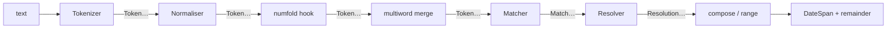

# Reading dates written by humans

The golden rule of this module: **turn "the 15th of Ramadan 1446" into a
span.** A person writes a date as a phrase — an ordinal, a month name from
whichever calendar they think in, a year — and `extract_timespan` turns
that phrase into the exact stretch of time it refers to.

```python
from chronologia import extract_timespan
from datetime import datetime

anchor = datetime(2024, 1, 1)   # what "now" means for relative phrases

span, remainder = extract_timespan("the 15th of Ramadan 1446", "en", anchor)
print(span.start_datetime.date())   # 2025-03-15
print(remainder)                    # the
```

The 15th of the Islamic month Ramadan in the Hijri year 1446 is the 15th
of March 2025 — computed, not looked up. The Islamic month name is read
straight from the English vocabulary; you do not have to tell the library
which calendar the phrase is in.

## What comes back

`extract_timespan(text, lang, anchor)` returns either `None` (nothing
matched) or a `DateSpanResult` — a named 2-tuple of `(span, remainder)`. You
can unpack it (`span, remainder = extract_timespan(...)`), index it
(`result[0]`), or read the named fields (`result.span`, `result.remainder`) —
all three access the same two values:

- **`span`** is a [`DateSpan`](getting-started.md) — a half-open interval,
  *not* a single instant. A phrase names a stretch of time, and the span's
  **width** is that stretch. "June 2027" is a month wide; "3 pm" is a
  minute wide. This is the whole reason the function exists: it never
  invents a precision the speaker did not give.
- **`remainder`** is the leftover text the parse did not consume — the
  words around the date, so a caller can see what was and was not a date.

## Supported languages

Pass any of these ISO codes as the `lang` argument. Each corresponds to a
vocabulary bundle under `chronologia/locale/<code>/`; asking for a code with
no bundle raises `NotImplementedError` naming the missing locale.

| | | | | |
|---|---|---|---|---|
| `an` Aragonese | `ar` Arabic | `ast` Asturian | `az` Azerbaijani | `bg` Bulgarian |
| `ca` Catalan | `cs` Czech | `da` Danish | `de` German | `el` Greek |
| `en` English | `es` Spanish | `et` Estonian | `eu` Basque | `fa` Persian |
| `fi` Finnish | `fr` French | `fy` West Frisian | `gl` Galician | `he` Hebrew |
| `hr` Croatian | `hu` Hungarian | `id` Indonesian | `it` Italian | `kab` Kabyle |
| `ms` Malay | `mwl` Mirandese | `nb` Norwegian Bokmål | `nl` Dutch | `nn` Norwegian Nynorsk |
| `oc` Occitan | `pl` Polish | `pt` Portuguese | `ro` Romanian | `ru` Russian |
| `sk` Slovak | `sl` Slovenian | `sv` Swedish | `tr` Turkish | `uk` Ukrainian |

English carries the widest grammar; coverage of the more specialised
constructions (regnal years, classical Roman date formulas, deep-time eras)
varies by language and is noted where it applies below.

## What goes in, and what raises

Every extractor — `extract_timespan`, `extract_timespans`, `extract_duration`,
`extract_recurrence`, `extract_candidates`, `extract_event` — takes text as a
`str`. Handing one anything else is a mistake in the calling program, and it
raises a `TypeError` naming the contract rather than letting an internal
error surface further down. Text the library cannot read is a different
matter entirely: the empty string, a whitespace run, or a sentence with no
date in it all return the extractor's empty result — `None` for the ones that
return a single value, an empty list for the ones that return several.

```python
from chronologia import extract_timespan

assert extract_timespan("", "en") is None
assert extract_timespan("the quick brown fox", "en") is None

try:
    extract_timespan(None, "en")
except TypeError as err:
    print(err)          # extract_timespan() reads text: expected str, ...
```

```python
from chronologia import extract_timespan
from datetime import datetime

june, _ = extract_timespan("june 2027", "en", datetime(2024, 1, 1))
print(june.width, "|", june.resolution.name)   # 30 days, 0:00:00 | MONTH

three_pm, _ = extract_timespan("3 pm", "en", datetime(2024, 1, 1))
print(three_pm.width)                           # 0:01:00
```

## The anchor

Relative phrases ("in three days", "next winter", "last tuesday") only mean
something relative to a moment. That moment is the `anchor` — pass the
caller's idea of "now"; it defaults to the wall clock.

```python
from chronologia import extract_timespan
from datetime import datetime

anchor = datetime(2017, 6, 27, 13, 4)   # a Tuesday

soon, _ = extract_timespan("in three days", "en", anchor)
print(soon.start_datetime)   # 2017-06-30 13:04:00

winter, _ = extract_timespan("next winter", "en", anchor)
print(winter.start_datetime.date())   # 2017-12-01
```

A season is read against the season the anchor falls in, not against the
calendar year. Someone saying "last summer" in July means the summer that has
finished, never the one they are standing in, and "next summer" is the one
after that. The December-starting winter runs into the new year, so in
January the winter in progress is the one that began the previous December:

```python
from chronologia import extract_timespan
from datetime import datetime

july = datetime(2017, 7, 15)
assert extract_timespan("last summer", "en", july).span.start.year == 2016
assert extract_timespan("this summer", "en", july).span.start.year == 2017
assert extract_timespan("next summer", "en", july).span.start.year == 2018

january = datetime(2018, 1, 15)
assert extract_timespan("last winter", "en", january).span.start.year == 2016
assert extract_timespan("this winter", "en", january).span.start.year == 2017
assert extract_timespan("next winter", "en", january).span.start.year == 2018
```

A range framed with "from A to B" or "between A and B" spans from the start
of the left endpoint to the end of the right one:

```python
from chronologia import extract_timespan
from datetime import datetime

span, _ = extract_timespan("from june 5th to june 12th", "en",
                           datetime(2017, 6, 27))
print(span.start_datetime.date(), "->", span.end_datetime.date())
# 2018-06-05 -> 2018-06-13
```

(June 5–12 is already past the June-27 anchor, so it rolls to the next
year — the engine prefers the future for bare calendar dates.)

Both endpoints resolve in the **same** frame: the future preference is
applied to the range as a whole, never to one endpoint alone. So a range
that *straddles* the anchor keeps both edges in the current cycle instead
of letting the left endpoint leap a year ahead of the right — spoken on
July 22, "from july 20 to july 25" is this year's July 20–25, not next
year's. A cross-year span like "from december 28 to january 3" simply rolls
the *end* into the following year so it never inverts. Any endpoint that
resolves to a date works — bare dates, dates with years, and holidays
("from christmas to new year's day") all compose, in dash form too
("july 20 - july 25").

**The month may be named once for the pair.** "del 5 al 12 de junio" (es),
"du 5 au 12 juin" (fr), "dal 5 al 12 giugno" (it), "с 5 по 12 июня" (ru) and
the English "June 5 to 12" all read as 5–12 June: the endpoint that carries
only a bare day is read through its partner's own words, so the day is never
dropped. This is one rule over the token stream — the partner's slice is
rebuilt with its numeral replaced — so the language's own glue ("de", "di")
and word order come along without a per-locale spelling. Two bare numbers
lend each other nothing, which is why "from 9 to 5" is still a working day
and "quarter to five" is still a clock.

**A language's "until" word closes a range as well as opening one.** English
"until" is both the open marker ("until friday") and a `to` connector ("from
june 5 until june 12"); every language's `marker_until` surface now does the
same job, so Persian "از ۵ ژوئن تا ۱۲ ژوئن", Indonesian "5 Juni sampai 12
Juni" and Malay "12 Jun hingga 20 Jun" are the closed ranges they say rather
than open ones running to "now". The named limit is included, matching the
open-range convention below and the sources those languages state it with —
Ожегов s.v. «по» II.1 ("Отпуск по воскресенье"), KBBI s.v. *sampai* sense 6
("perjanjian itu berlaku sampai tahun depan"), Kamus Dewan s.v. *hingga*.

**Open-ended ranges** name a single endpoint and pin the other edge to the
anchor ("now"). The named endpoint keeps the closed-range convention — the
*until* endpoint contributes its end (it is included in full, like the right
endpoint of "from A to B"), the *since* endpoint its start:

```python
extract_timespan("until friday", "en", datetime(2017, 6, 27, 13, 4))[0]
# [2017-06-27 13:04, 2017-07-01)  -- now through the whole of Friday
extract_timespan("since 2010", "en", datetime(2017, 6, 27, 13, 4))[0]
# [2010-01-01, 2017-06-27 13:04)  -- start of 2010 up to now
```

The `until`/`through` (open start) and `since` (open end) surfaces are
per-language range markers, so "bis freitag" / "seit 2010" (de), "jusqu'à
vendredi" / "depuis 2010" (fr), "até sexta-feira" / "desde 2010" (pt) and
"hasta viernes" / "desde 2010" (es) behave the same way.

### Marker positionality

*Where* a marker sits relative to its date is a first-class per-language fact,
declared as `positions` in `lang.json` (a role → position map over the
open-range and recurrence-bound markers `until` / `since` / `for`). Three
positions are recognised; the default, when a role is undeclared, is `pre`:

- **`pre`** — the marker **leads** its date ("until friday", German "bis
  freitag", French "jusqu'à vendredi"). The English/Romance default.
- **`post`** — the marker is a **postposed bound word trailing** its date, the
  native order for many agglutinative languages: Finnish "perjantai asti" /
  "2020 saakka", Turkish "cumaya kadar", Basque "ostirala arte", Azerbaijani
  "2020 qədər", Hungarian "2010 óta" (since). The engine scans for the marker
  after the resolved endpoint.
- **`affix`** — the marker is a **bound suffix fused onto the date's final
  surface token**, with no space or separator. Hungarian's until case suffix
  `-ig` is the canonical case: "péntekig" = "péntek" (Friday) + "ig",
  "hétfőig", "2026-ig". The engine splits a known affix off the last token and
  re-resolves the stripped host, and accepts the split **only when the host
  without the affix parses as a date** — so a common word ending in the same
  letters ("nadrágig" = "trousers-until") never misfires. A bare affix with no
  host is never a range.

The `positions` fact drives which readings the engine attempts; a language
declares `until: affix` or `since: post` alongside the ordinary
`marker_until` / `marker_since` vocabulary that lists the surface. This retired
the earlier "documented limitation" list: the postposed open-range markers
(Finnish `asti`/`saakka`, Turkish `kadar`, Basque `arte`, Azerbaijani `qədər`)
and the Hungarian `-ig` affix and `óta` postposition now resolve natively
rather than being noted as untranslatable order exceptions.

Basque `arte` is genuinely ambiguous — it means both "until" and "art" — so it
only reads as the range marker when the head parses as a date endpoint; a bare
"arte" is never a range. Turkish/Azerbaijani add a dative suffix to the date
noun in careful speech, which is a downstream morphology concern; the engine
reads the bare head.

## Deep time and other reckonings

Because the extractor resolves against the full reckoning core, it reaches
places `datetime` cannot. "66 million years ago" is a real span — its edges
are `AstroDate`, and `start_datetime` is simply `None` when a year falls
outside `datetime`'s range:

```python
from chronologia import extract_timespan
from datetime import datetime

span, _ = extract_timespan("66 million years ago", "en", datetime(2017, 6, 27))
print(span.start.year, span.resolution.name)   # -65998050 EPOCH_GEOLOGICAL
print(span.start_datetime)                      # None
```

## Historical references

Humans date the past in ways `datetime` never dreamed of: a century in Roman
numerals, a year "from the founding of Rome", an Olympiad, the archon a Greek
year was named after, or a Roman calendar formula. The extractor reads them all
and returns a real span — often a span whose edges fall centuries or millennia
BC, so `start_datetime` is `None` and the `AstroDate` endpoints carry the value.

Everything in this section resolves through the reckoning core (`chronologia.roman`,
`chronologia.eras`, `chronologia.regnal`, `chronologia.archons`) — the extractor
only recognises the surface; the arithmetic lives in one audited place.

### Roman-numeral centuries (século XII, XIIe siècle, the XII century)

Writing a century in Roman numerals is the *ordinary* written form across the
Romance languages, and common in English:

```python
from chronologia import extract_timespan
from datetime import datetime
anchor = datetime(2017, 6, 27)

extract_timespan("the XII century", "en", anchor)[0].start.year   # 1100
extract_timespan("século XII",      "pt", anchor)[0].start.year   # 1100
extract_timespan("siglo XII",       "es", anchor)[0].start.year   # 1100
extract_timespan("secolo XII",      "it", anchor)[0].start.year   # 1100
extract_timespan("XIIe siècle",     "fr", anchor)[0].start.year   # 1100
```

The Portuguese/Spanish/Italian form puts the numeral *after* the unit
(`século XII`); French puts an ordinal-suffixed numeral *before* it
(`XIIe siècle`, the `e` is the ordinal marker — `Ier` for the first). Both read
to the same span. An explicit year in Roman numerals works too, beside a year
word: `anno MMXX` and `year MMXX` both land on 2020.

**Why a bare `V` or `mix` never becomes a number.** A Roman numeral is also an
everyday word or letter — `mix`, `dix` ("ten" in French), `vi` ("I saw" in
Portuguese), a bare `V` or `C`. Binding those to a value would be a disaster, so
a Roman-numeral surface resolves **only** when two conditions hold together:

1. its original spelling is **upper-case** and a well-formed numeral
   (`chronologia.roman.roman_to_int`, which rejects `IIII`, `VV`, `IC`, …); and
2. it sits **beside a gating context** — a century/millennium unit on either
   side, a year marker just before, or a Roman calendar anchor just after.

So `mix it up`, `dix ans`, `vi o filme`, `V for Vendetta` and a lone `MMXX` all
resolve to nothing; only `century XII` / `XII century` / `anno MMXX` bind.

### Ab urbe condita, Olympiads, and Attic archonships (English)

```python
# ab urbe condita — the Varronian epoch (AUC 1 = 753 BC, AUC 753 = 1 BC)
extract_timespan("753 ab urbe condita", "en", anchor)[0].start.year   # 0  (1 BC)
extract_timespan("AUC 753", "en", anchor)[0].start.year               # 0

# Olympiads — a 4-year span from the 776 BC first Olympiad, opening at midsummer.
# Olympiad 1 = 776–772 BC; Olympiad N opens in Gregorian year 4N−779.
extract_timespan("the third olympiad", "en", anchor)[0].start   # AstroDate(-767, 7, 1)
# an inner "Nth year of" narrows to one year of the tetrad:
# Olympiad 87.2 = 431 BC, the outbreak of the Peloponnesian War
extract_timespan("the 2nd year of the 87th olympiad", "en", anchor)[0].start  # -430-07-01

# Attic eponymous archonships — the archon-year ran midsummer to midsummer
extract_timespan("in the archonship of eucleides", "en", anchor)[0].start  # -402-07-01 (403/402 BC)
```

Only **securely-dated, unambiguously-named** archons are wired (Solon,
Themistocles, Eucleides, Pythodorus, …), from a small primary-cited table
(`chronologia/calendar_data/attic_archons.tab`). A name that was never an
eponymous archon — *Pericles*, who held the generalship, not the archonship —
is simply absent, so `in the archonship of pericles` resolves to nothing rather
than to a guess.

### Regnal years over a succession of reigns

The `regnal_date` construction reads "the Nth year of a reign". The registry
(`chronologia.regnal.REGNAL_SEQUENCES`) holds three attested kinds:

| sequence key(s) | coverage | surfaced in English vocab |
|---|---|---|
| `nengo` | modern Japanese era names, Meiji → Reiwa | ✅ all five |
| `consuls` | Roman consular *pairs* (eponymous years) | ❌ (registry only) |
| `egyptian_high` / `egyptian_middle` / `egyptian_low` | New-Kingdom pharaohs in the three standard chronology variants | ✅ the **low** (conventional) variant |

Rulers whose names carry a Roman-numeral ordinal (*Ramesses II*, *Thutmose III*)
have that ordinal as part of the **name**, matched literally:

```python
# Ramesses II (low chronology) acceded 1279 BC; regnal year 5 = 1275 BC
extract_timespan("the fifth year of ramesses ii", "en", anchor)[0].start.year   # -1274
extract_timespan("the third year of reiwa", "en", anchor)[0].start.year          # 2021
```

Rulers the registry does **not** contain (Nero, Augustus, Elizabeth II, Louis
XIV) do not resolve — the extractor wires only what the data attests, and the
coverage table above is the whole of it.

### The `classical` group flag — opt-in raw-Latin formulas

Most historical surfaces above are *unambiguous* — nobody writes "the XII
century" by accident — so they are **on by default**. The raw-Latin
*ante-diem count* formula is different: `ante diem III kalendas apriles`
("the 3rd day before the Kalends of April" = 30 March) is genuine classical
Latin, but its bare, inflected surface is exotic enough that it should not fire
unless asked for. It lives in the **`classical` construction group**, declared
in `lang.json` (`"group": "classical"` on the construction) and gated OFF unless
the caller opts in:

```python
text = "ante diem III kalendas apriles"

extract_timespan(text, "en", anchor)                         # None  (off by default)
extract_timespan(text, "en", anchor, enable=("classical",))  # 30 March span
```

**The doctrine.** A construction carrying a `"group": <name>` tag in `lang.json`
is off unless `<name>` appears in the `enable=(...)` tuple passed to
`extract_timespan`; a construction with no group tag is always on. The rule of
thumb for *which* group a surface belongs in: **default-on surfaces are the ones
a modern writer produces unambiguously** (Roman-numeral centuries, AUC,
Olympiads, archonships, the everyday "ides of march"); **`classical`-gated
surfaces are the raw, inflected Latin formulas** a classicist opts into. The
flag threads through exactly like `jurisdiction` — one keyword argument, no
change to the returned `(span, remainder)` shape.

### Kalends, Nones, Ides -- in the reader's own language

"The ides of march" is the everyday, default-on surface for the Roman
within-month anchors, and it does not stop at English or Latin. The extractor
reads Kalends, Nones, and Ides as **vernacular phrases**, each in that
language's own words, across es, pt, ca, gl, it, fr, ast, ro, de, and nl:

```python
anchor = datetime(2017, 6, 27, 13, 4)

extract_timespan("the ides of march", "en", anchor)[0].start_datetime   # 2017-03-15
extract_timespan("os idos de março",  "pt", anchor)[0].start_datetime   # 2017-03-15
extract_timespan("los idus de marzo", "es", anchor)[0].start_datetime   # 2017-03-15
extract_timespan("le idi di marzo",   "it", anchor)[0].start_datetime   # 2017-03-15
extract_timespan("die Iden des März", "de", anchor)[0].start_datetime   # 2017-03-15
```

Every surface is attested, not invented: each `roman_anchor_kalends.voc` /
`roman_anchor_nones.voc` / `roman_anchor_ides.voc` file
(`chronologia/locale/<lang>/`) carries a header citing that language's
Wikipedia "Roman calendar" article (e.g. `pt/roman_anchor_ides.voc` cites
`pt.wikipedia.org/wiki/Calendário_romano`; `nl` cites the dedicated
`Nonen (kalender)` / `Iden (kalender)` articles) as the source for the word
it wires.

**The distinctive part is composition, not the vocabulary.** These anchors
are just another named reference point to the same anchored-arithmetic engine
that resolves "3 days before christmas" (see below), so **any** offset
composes with **any** anchor in **any** of the eleven languages, for free --
nothing month-specific or language-specific had to be taught to the offset
logic:

```python
extract_timespan("a week before the ides of march", "en", anchor)[0].start_datetime
# 2017-03-08

extract_timespan("3 dias antes das calendas de abril", "pt", anchor)[0].start_datetime
# 2017-03-29

extract_timespan("une semaine avant les ides de mars", "fr", anchor)[0].start_datetime
# 2017-03-08

extract_timespan("de Nonen van juli", "nl", anchor)[0].start_datetime
# 2017-07-07
```

**The honest detail: Ides and Nones move.** They are not always "the 15th"
and "the 7th" -- the Roman calendar puts the Ides on the 15th only in March,
May, July, and October; every other month it falls on the 13th. The Nones is
always the 8th day before the Ides (inclusive Roman counting), so it lands on
the 7th in those four months and the 5th elsewhere. `los idus de abril`
resolves to April 13th, not the 15th, because April is not one of the four
long months:

```python
extract_timespan("los idus de abril", "es", anchor)[0].start_datetime   # 2017-04-13
extract_timespan("los idus de marzo", "es", anchor)[0].start_datetime   # 2017-03-15
```

The library computes this per month (`chronologia.roman._ides_day` /
`_nones_day`) rather than hard-coding a single day-of-month, so the
composition above is correct for every month, not just the famous March
case.

**Inclusive counting is a property of the Latin idiom, not of the "N days
before" offset — the surface you write picks the convention.** Classical
Latin counted *inclusively*, with the anchor day itself as day 1, and that
convention fires **only** when you write the raw Latin ante-diem formula
(opt-in via `enable=("classical",)`, see above): `ante diem III kalendas
apriles` is the *3rd* day counting inclusively from the Kalends of April,
landing on March 30th, and `pridie kalendas apriles` ("the day before the
Kalends") lands on March 31st. The vernacular "N days before/after
`<anchor>`" phrasing, by contrast, is **plain, non-inclusive arithmetic** —
exactly like "3 days before christmas" — in every language, and is *not* the
Roman count: "3 days before the kalends of april" and "the third day before
the kalends of april" both land on March 29th, one day earlier than the
Latin idiom's "3rd day":

```python
extract_timespan("ante diem III kalendas apriles", "en", anchor,
                  enable=("classical",))[0].start_datetime
# 2017-03-30  (Roman inclusive count)

extract_timespan("pridie kalendas apriles", "en", anchor,
                  enable=("classical",))[0].start_datetime
# 2017-03-31  (Roman inclusive count)

extract_timespan("3 days before the kalends of april", "en", anchor)[0].start_datetime
# 2017-03-29  (plain, non-inclusive offset)

extract_timespan("the third day before the kalends of april", "en", anchor)[0].start_datetime
# 2017-03-29  (plain, non-inclusive offset -- same value as above)
```

## The week of a date, and decades before Christ

Two phrasings widen a date to the period a speaker really meant. **"the week
of <date>"** resolves the date inside it and returns the whole seven-day week
that contains it — aligned to the locale's `week_start` (Monday for the
languages that carry the marker). The marker itself ("the week of", Portuguese
"a semana de", German "die woche vom", French "la semaine du", ...) is a
per-language fact; the widening is generic, so it wraps *any* date the engine
already resolves:

```python
from chronologia import extract_timespan
from datetime import datetime

anchor = datetime(2017, 6, 27)
span, remainder = extract_timespan("the week of july 20 2026", "en", anchor)
print(span.start_datetime.date(), span.end_datetime.date())  # 2026-07-20 2026-07-27
print(span.width.days)                                        # 7

# same widening, driven only by each locale's own marker vocabulary
pt, _ = extract_timespan("a semana de 20 de julho de 2026", "pt", anchor)
de, _ = extract_timespan("die woche vom 20. juli 2026", "de", anchor)
print(pt.start_datetime.date(), de.start_datetime.date())     # 2026-07-20 2026-07-20
```

**BC decades** name a decade by its base year the way "the 1990s" does, but on
the BC axis. "the 300s bc" is the BC-labelled years 309..300 BC. The edges run
through the same `before_christ` era registry the century form (`the 3rd
century bc`) uses, so the two tile consistently — a decade-BC span is ten years
wide:

```python
from chronologia import extract_timespan
from datetime import datetime

anchor = datetime(2017, 6, 27)
span, _ = extract_timespan("the 300s bc", "en", anchor)
print(span.start.year, span.end.year)   # -308 -298
print(span.width.days)                   # 3652  (ten years, two leap days)
```

## Business days ("in 5 business days", "the next working day")

A **business day** (or working day) is a calendar day that is neither a weekend
day nor a public holiday. Two phrasings resolve to one:

- **counting from now** — "in N business days", "N working days", and "the next
  working day" (which is simply N=1) return the N-th business day *strictly
  after* the anchor date, as a day-wide span;
- **counting from a reference** — "3 working days after christmas", "two
  business days before new year" count the same way, but from a date the engine
  already resolved (any holiday or calendar date), reusing the same composition
  as the rest of the anchored arithmetic.

The weekend is the locale's own two-day rest period (the `weekend_start`
convention — Saturday+Sunday by default, Friday+Saturday where a locale declares
it), never hard-coded. The surfaces are a per-locale fact (`marker_business.voc`:
`business`/`working`, `dia útil`, `día hábil`/`laborable`, `Werktag`/`Arbeitstag`,
`jour ouvrable`/`ouvré`); the counting is generic.

**The holiday calendar needs a jurisdiction.** Which weekdays are public
holidays is not knowable without one, so `extract_timespan` takes an optional
`jurisdiction` (an ISO country code). With it, public holidays of that
jurisdiction are skipped (looked up through the shared civil-holiday engine — the
holiday data is never re-derived here). **Without** it, the count is
*holiday-blind*: weekend-aware, but every weekday is treated as a business day.
This is an honest, documented default, not an oversight.

```python
from chronologia import extract_timespan
from datetime import datetime

# a Wednesday; Christmas (Fri 25 Dec) and New Year (Fri 1 Jan) fall just ahead
anchor = datetime(2026, 12, 23)

# with a jurisdiction, Christmas Day and the weekend are skipped
span, _ = extract_timespan("in 2 business days", "en", anchor, jurisdiction="PT")
print(span.start_datetime.date())   # 2026-12-28  (Thu 24 counts, Fri 25 is Natal)

# holiday-blind default: Christmas Day now counts as an ordinary weekday
span, _ = extract_timespan("in 2 business days", "en", anchor)
print(span.start_datetime.date())   # 2026-12-25

# "the next working day" == N=1
span, _ = extract_timespan("the next working day", "en", anchor, jurisdiction="PT")
print(span.start_datetime.date())   # 2026-12-24

# composition on a resolved reference — counted from Christmas, not "now"
span, _ = extract_timespan("3 working days after christmas", "en", anchor,
                           jurisdiction="PT")
print(span.start_datetime.date())   # 2026-12-30  (Mon 28, Tue 29, Wed 30)

# each locale in its own spoken form (día hábil, Werktag, jour ouvré, dia útil)
for lang, phrase in [("pt", "em 2 dias úteis"), ("es", "en 2 días hábiles"),
                     ("de", "in 2 Werktagen"), ("fr", "dans 2 jours ouvrés")]:
    s, _ = extract_timespan(phrase, lang, anchor, jurisdiction=lang.upper())
    print(lang, s.start_datetime.date())   # each -> 2026-12-28
```

On `ouvrable` vs `ouvré` (and similar fine distinctions elsewhere): French law
separates *jours ouvrables* (all days bar the weekly rest day and holidays) from
*jours ouvrés* (days actually worked). Chronologia does not model that
payroll-grade split — both resolve to the same Monday-to-Friday-minus-holidays
business day, the everyday sense a speaker means by "working day".

## Seeing why a parse landed

`explain` opens a debug window over the same pipeline: the tokens, every
construction that matched, and which one won. It takes a compiled language
spec rather than a language code.

```python
from chronologia import explain
from chronologia.extract import load_lang_spec
from datetime import datetime

trace = explain("the 3rd week of june 1969", load_lang_spec("en"),
                datetime(2017, 6, 27))
print(len(trace.tokens), "tokens,", len(trace.winners), "winning construction")
# 6 tokens, 1 winning construction
```

`trace.report()` returns the whole thing as readable text — reach for it
when a phrase parses to something you did not expect. `explain` runs the
**identical** pre-match pipeline as `extract_timespan` — the same
spelled-number fold and multiword merge — so its trace of a phrase reflects
the real parse token-for-token, written-out numbers and all.

## How sure is it? Confidence and ranked candidates

Every parse also carries a **confidence** — a number in `(0, 1]` saying how much
the engine trusts that this reading is the one you meant. It is computed from
signals the parse already produced and would otherwise throw away, and it is
**deterministic**: the same text always scores the same. There is no machine
learning anywhere in it.

`extract_candidates` returns the ranked list of *every* plausible reading the
matcher considered — not just the winner `extract_timespan` hands back, but the
runner-ups too — each with its confidence and the leftover text:

```python
from chronologia.extract import extract_candidates
from datetime import datetime

for c in extract_candidates("june 2027", "en", datetime(2017, 6, 27)):
    print(c.construction, round(c.confidence, 3), repr(c.remainder))
# calendar_date 0.915 ''      -> the whole phrase read as a month+year
# year_ref      0.457 'june'  -> a weaker reading: just "2027", "june" stranded
```

The score answers "how sure are we of this reading", not "how much of the
sentence did it explain". A phrase read the same way scores the same however
much ordinary conversation surrounds it:

```python
for text in ("tomorrow", "meet me tomorrow if that works for you at all"):
    print(round(extract_candidates(text, "en")[0].confidence, 3))
# 0.85
# 0.85
```

`extract_timespans` (multi-mention) and `extract_event` also surface the score:
each `TimeMention` and each `Event` carries a `.confidence`, and each mention is
scored on its own reading rather than on its share of the carrier sentence.

### What the score is made of

It is a **weighted product** of five factors, each a multiplier in `(0, 1]`
where `1.0` means "no objection":

```
confidence = coverage · (specificity^0.40 · homograph^0.30 · fold^0.15 · basis^0.15)
```

* **coverage** — the share of the *date-bearing region* the reading claimed.
  The region is the contiguous run of tokens some reading wanted; it stops at
  the first word nothing temporal was found in, so the prose around a date is
  never counted against it. Coverage enters *linearly* because it is the
  strongest signal: of two readings of "tomorrow at 3pm", the one explaining
  three of the four tokens is trusted roughly twice as far as the one
  explaining two.
* **specificity** — read straight off the construction precedence table
  (`chronologia/extract/compiler.py`): an era, regnal or deep-time reading
  carries the most specific vocabulary and scores highest; a bare year is the
  least specific and scores lowest.
* **homograph** — a penalty when the reading leans on a language's short
  weekday-abbreviation surface (the forms like "mar", "so", "zo" that also read
  as ordinary words). That set is the locale's own data — the abbreviations the
  loader keeps out of the full weekday names — not a hand-listed lexicon.
* **fold** — a plain digit ("5") is trusted over a spelled-out number the engine
  folded ("five") over a multiword surface it glued back together ("bronze
  age"); each rung down is a small penalty.
* **basis** — the resolved span's own provenance: `exact` > `tabulated` >
  `reconstructed` > `predicted` (see the deep-time section above).

The four quality factors combine as a weighted geometric mean, so a single weak
signal drags the whole score down the way a weak link should, and every input
has a clear unit-interval reading.

### What confidence is **not**

It is **not a probability**. It does not estimate "the chance this parse is
correct" and the numbers do not sum to one across candidates. It is a *relative
trust score* built to **rank** readings — nothing more. Do not threshold it as
if 0.7 meant "70 % likely right"; do use it to prefer one candidate over
another, or to decide a partial reading is not worth acting on without
confirmation.

It is also **not a judgement about the sentence**. A look-alike the parser
cannot tell from a real date — "christmas came early", "fall for the trick" —
is read as confidently as the real thing, because the reading genuinely is the
same one; telling the two apart needs the sentence's meaning, which belongs to
the consumer (see "Known limitations"). What the engine does hold itself to as
a tested contract is a floor: across a sample of every language's gold corpus,
a fully-claimed gold phrase scores at or above `0.75` however long the sentence
carrying it is (`test/test_confidence.py`).

## Holidays by name

A **construction** is one named shape the extractor knows how to read (a
calendar date, a relative offset, a season …); each has its own resolver that
turns a match into a span. `holiday_ref` is the construction that reads a
holiday spoken by *name* — "christmas", "when is easter", "next christmas" —
and returns the holiday's own day-wide span. Movable feasts (Easter and its
whole cycle) are computed through the same computus the rest of the library
uses, so "easter" is a real date in any year, not a lookup table that runs out.

The names a language recognises are **facts**, harvested at load time from the
holidays engine's own name tables (official native names, display translations)
plus a small curated table of spoken aliases — never hand-listed here. A
locale binds the globally well-known set (Christmas, New Year, Epiphany, Easter
and its cycle, Assumption, All Saints, Carnival …) in *its own language*, and
nothing more: the reference is scoped to what people in that language actually
say, not to every jurisdiction's full rule catalogue.

A bare **"new year"** in English is recognised as New Year's Day (1 January),
consistently across `extract_timespan`, `extract_candidates`, and phrase
composition ("new year party"). The **definite-article** form, "*the* new
year", is deliberately *not* the holiday — it is the ambiguous "coming year"
period — and does not resolve to 1 January.

```python
from chronologia import extract_timespan
from datetime import datetime

# a fixed anchor so the examples are reproducible: a Tuesday in June 2017
now = datetime(2017, 6, 27)

# a bare name -> the next occurrence on or after today.  Christmas is still
# ahead this year, so it is this year's 25 December (a whole-day span).
span, _ = extract_timespan("christmas", "en", now)
print(span.start, span.width)          # 2017-12-25 00:00:00 1 day, 0:00:00

# Easter has already passed in 2017 (16 April), so a bare "easter" rolls to
# next year's — resolved through the computus engine, not a table.
span, _ = extract_timespan("when is easter", "en", now)
print(span.start.year, span.start.month, span.start.day)   # 2018 4 1

# "next" is strictly future; "last" is the most recent past occurrence.
print(extract_timespan("next christmas", "en", now)[0].start)   # 2017-12-25
print(extract_timespan("last easter", "en", now)[0].start)      # 2017-04-16

# an explicit year pins that year's occurrence, no roll.
print(extract_timespan("easter 2020", "en", now)[0].start)      # 2020-04-12

# the same meaning in other languages — each in its own spoken form.
print(extract_timespan("natal", "pt", now)[0].start)            # 2017-12-25
print(extract_timespan("quand est pâques", "fr", now)[0].start) # 2018-04-01
print(extract_timespan("weihnachten", "de", now)[0].start)      # 2017-12-25
```

`explain` traces the binding: it shows which well-known holiday key the surface
resolved to and the jurisdiction and official name the surface was harvested
from, so you can always see *why* a word bound a holiday.

```python
from chronologia import explain
from chronologia.extract import load_lang_spec
from datetime import datetime

trace = explain("next christmas", load_lang_spec("en"), datetime(2017, 6, 27))
won = trace.winners[0]
print(won.match.construction)          # holiday_ref
print(won.match.calendar)              # christmas <PT:Natal>
```

### Beyond the Western core — world holidays

The well-known set is **not** only the Christian/Western calendar. It also
binds the major movable feasts of other traditions, each resolved through a
date mechanism the library already models — never re-derived, never invented:

* **Islamic** (Eid al-Fitr, Eid al-Adha, Islamic New Year, Ashura, Mawlid):
  a fixed date in the tabulated **Umm al-Qura** calendar. Basis `tabulated`.
* **Jewish** (Rosh Hashanah, Yom Kippur, Passover, Hanukkah): a fixed date in
  the arithmetic **Hebrew** calendar. Basis `exact`. The asserted day is the
  first *full* civil day (a feast begins the preceding sunset).
* **East-Asian** (Chinese/Lunar New Year, Mid-Autumn Festival): a fixed date in
  the tabulated **Chinese** lunisolar calendar. Basis `tabulated`.
* **Nowruz** (Persian New Year): 1 Farvardin in the arithmetic **Solar Hijri**
  calendar (the March-equinox new year). Basis `exact`.
* **Orthodox Easter and its cycle**: the Julian computus rendered on the civil
  calendar (`julian_gregorian_date`) — the same engine as the Western one.
* **Orthodox Christmas** and its eve. Which calendar a country keeps it on is a
  civil fact, and three cases are modelled distinctly:
  * **Still on the Julian calendar** (ru "рождество христово", and Serbia /
    Georgia): the Nativity fixed at Julian December 25 (and 24), resolved
    through the registered `julian` calendar — so the offset the calendar
    already carries lands it on Gregorian Jan 7 (Jan 6 for the eve) for
    1900–2099, never a hard-coded constant.
  * **Revised-Julian / New-Calendar** — Gregorian Dec 25 (the plain `christmas`
    key): Greece (el), Romania (ro) and Bulgaria (bg "коледа", Revised Julian
    since 1968). These are deliberately *not* aliased to the Julian one.
  * **Moved by law within the modern era** — Ukraine (uk "різдво"): its civil
    Christmas was Julian (civil Jan 7) through 2022 and Gregorian Dec 25 from
    2023 (OCU calendar switch). This is a *year-gated* holiday, so "різдво 2020"
    resolves to Jan 7 and "різдво 2024" to Dec 25 — the date actually in force
    for the queried year, not one date retro-/post-dated across the reform.
* **Decree-tabulated feasts** (Diwali, Vesak): no closed-form calendar is
  modelled here, so — honestly — they carry explicit published per-year dates
  (a *decree table*). Outside the listed years the reference simply does not
  resolve, rather than fabricating a date.

Because the calendar-table feasts inherit their calendar's published range,
they are **silent outside it**: a year whose occurrence falls beyond the table
yields no span at all (honest silence, never a wrong guess).

**Decree horizons and prediction.** A decree table is authoritative only across
the span of years it lists — its *horizon*. Silence past the horizon is a trap:
asking a 2024–2027 table for 2028 returns nothing, indistinguishable from "no
such holiday". Where a decree holiday really follows a computable calendar (the
big Islamic feasts on Umm al-Qura, the Chinese lunisolar cluster) the row
carries a `predict` annotation naming the well-known rule that bridges past the
horizon, so 2028 resolves through the calendar with **basis `predicted`**
instead of vanishing. The annotations are correct-by-construction: a row is
annotated with a key only where that key's computed date equals the row's
tabulated date for *every* listed year, so a jurisdiction whose gazetted
observance diverges from the calendar is left honestly un-predicted. Genuinely
gazette-only holidays (调休-adjacent shifts, one-offs) have no computable
mapping and stay silent — but the gap is now *reported*, not hidden:
`coverage(jurisdiction, year)` returns `full` / `predicted` / `partial` /
`none` so a caller can detect the horizon instead of trusting the silence, and
every resolved `CivilHoliday` carries its `basis`.

**Subtractive `exclude` rules.** The engine is otherwise additive, but a
subdivision may observe *fewer* holidays than its nation (US-ND and US-UM do not
observe Columbus Day; Delaware and Florida do not observe Washington's
Birthday). An `exclude` rule, scoped to a subdivision, removes a named inherited
holiday — so the subdivision's set is the national set minus what it genuinely
drops, verified against the reference database.

```python
# each holiday in a language that actually names it.
print(extract_timespan("when is eid", "en", now)[0].start)          # 2018-06-15
print(extract_timespan("chinese new year", "en", now)[0].start)     # 2018-02-16
print(extract_timespan("diwali 2026", "en", now)[0].start)          # 2026-11-08
print(extract_timespan("hanukkah", "en", now)[0].start)             # 2017-12-13

# native scripts resolve the same way (Arabic / Hebrew locales).
print(extract_timespan("عيد الفطر", "ar", now)[0].start)             # 2018-06-15
print(extract_timespan("חנוכה", "he", now)[0].start)                # 2017-12-13
```

### Jurisdiction-bound names — one word, many countries

A few holiday *names* only pick out a date once a country is assumed, because
the same word means a different rule in different places. **Mother's Day** is
the 2nd Sunday of May in the US, Germany and Italy, the 1st Sunday of May in
Portugal and Spain, and the last Sunday of May in France; **Father's Day** is
the 3rd Sunday of June in the US and France but 19 March (St Joseph) in
Portugal, Spain and Italy. These live in a second tier (`JURISDICTION_KNOWN`)
keyed by `(name, language)`, so each locale resolves the name through *its own*
jurisdiction default:

```python
print(extract_timespan("mother's day", "en", now)[0].start)   # 2018-05-13 (US: 2nd Sun May)
print(extract_timespan("dia da mãe", "pt", now)[0].start)     # 2018-05-06 (PT: 1st Sun May)
print(extract_timespan("fête des mères", "fr", now)[0].start) # 2018-05-27 (FR: last Sun May)
```

Names with no single implied country are deliberately **left unresolved**:
"independence day" in English could mean any of dozens of nations, so it is not
bound to one — a jurisdiction word would be needed to disambiguate it, and
guessing would be dishonest. Thanksgiving binds the **US** rule (4th Thursday of
November) for English; Canada's Thanksgiving (2nd Monday of October) is a
genuinely different rule and is not silently resolved to the US date.

One deliberate overlap: a word that is *both* a holiday and a calendar month
(Ramadan is the Hijri month *and* the fast) resolves, when followed by a year,
to the **calendar** reading (`ramadan 1446` is the Hijri month of year 1446 AH,
not "the holiday in year 1446") — the calendar family wins that equal-length tie
on purpose.

## How it actually works

Think of the module as an **assembly line**. A sentence enters at one end
as a string; each station does one small, testable thing and hands its
output to the next; a `DateSpan` rolls off the other end. No station reaches
back, no station knows the language it is processing — the language is just
the parts bin the stations pull from.

That is the whole design in one sentence: **language is data, capability is
a resolver, and the two never entangle.** A new language adds `.voc` files
and a `lang.json`; a new capability adds a construction and a resolver
method. Neither touches the other, because the stations in between are
language-agnostic and the date math is capability-agnostic.



The core stations — `Tokenizer`, `TemporalNormaliser`, `ConstructionMatcher`,
`Resolver` — live in `chronologia/extract/` and are shared by every
language. `DateTimeEngine` is the facade that wires them together for one
language; `extract_timespan` is the public front door that adds the range
and composition passes on top.

> **Note** — `DateTimeEngine` and the per-stage classes below are shown here to
> illustrate the pipeline; they are internal, not part of the public API (not in
> `chronologia.__all__`), and may change without notice. Build on
> `extract_timespan` and the other public entry points; use `explain()` (below)
> for a stable introspection trace.

### The values that flow down the line

Every value handed between stations is a **frozen dataclass** (from
`chronologia/extract/model.py`) — immutable, hashable, unit-testable in
isolation:

- **`Token`** — one lexical unit: `text` (the normalised form the matcher
  sees), `raw` (the original surface, kept so the remainder can be
  reconstructed), `index`, and for numbers `is_number` / `value`.
- **`SlotElement`** / **`SlotOrder`** — a compiled construction *order* such
  as `"MONTH DAY? YEAR?"`. Each element carries `name`, `optional` (the
  trailing `?`), and `is_slot` (an uppercase placeholder like `MONTH` vs. a
  lowercase literal connector like `of`).
- **`Match`** — one construction *claiming* a span of tokens: `construction`
  (its name), `span` (a half-open `(start, end)` token range), `slots` (the
  bound `name -> Token` map), and an optional `calendar` for non-Gregorian
  months.
- **`Resolution`** — a match's meaning: `value` (a `DateSpan`) plus
  `consumed` (the token indices it used). The `DateTimeResolution` tag is
  *derived* from the span's width, never stored separately.
- **`DateSpan`** — the end product, a half-open interval whose **width is
  the precision the writer gave** (see [getting started](getting-started.md)).

### Station by station

**1. Tokenizer** (`tokenizer.py`). Text → `tuple[Token]`. It lower-cases,
splits on a small regex, and keeps ISO literals (`2017-06-30`) and clock
literals (`15:30`) whole. Digit runs become numeric tokens; everything else
is language-neutral. Three per-language switches (`split_contractions`,
`ordinal_dot`, `dotted_date`) come from `lang.json`.

**2. Normaliser** (`normaliser.py`). `Token → Token`, closed-class
morphology only: a lemma map (`tygodni → tydzien`) then rule-based suffix
stripping. Numbers pass through untouched; only `text` changes, `raw` is
preserved.

**3. The numfold hook** (`numfold.py`, wired for English via `lang.json`'s
`hook`). The tokenizer only sees *digit* numbers, but people write "the
twenty fifth" and "the third week". This pass folds a maximal run of English
number-words into one digit token, so a `DAY`/`YEAR`/`ORD` slot binds the
same whether the writer typed `5` or `five`. It deliberately does **not**
fold `half`/`quarter` (those are clock fractions) or scale words like
`million` (those separate deep time from a plain offset).

**4. Multiword merge** (`chronologia.extract.pipeline.merge_multiword`,
reached through `fold_tokens`). Vocabulary
surfaces that contain spaces ("bronze age") get glued back into a single
token, longest phrase first, so one slot can bind them.

You can watch the tokens that reach the matcher directly:

```python
from chronologia.extract import DateTimeEngine, load_lang_spec

engine = DateTimeEngine(load_lang_spec("en"))
toks = engine.tokenize("the third week of june")
print([t.text for t in toks])   # ['the', '3', 'week', 'of', 'june']
```

"third" was folded to `3`; the matcher never sees a spelled number.

**5. Matcher** (`matcher.py`). Tokens → non-overlapping `Match`es. Each
compiled construction order is tried at every start position by a plain
backtracking walk (`_walk`); optional slots try both present and skipped,
and the longest consumption wins. Binding a slot is a single lookup into the
language's typed vocab maps — `MONTH` checks `spec.months`, `DAY` checks
"is a number 1–31", and so on. There are no per-language regexes to debug,
only named slots. Then `_select` sorts every candidate by **longest span
first, ties broken by precedence, then by position**, and greedily takes
non-overlapping winners.

```python
from chronologia.extract import DateTimeEngine, load_lang_spec

engine = DateTimeEngine(load_lang_spec("en"))
matches = engine.matcher.match(engine.tokenize("june 5th 2027"))
for m in matches:
    print(m.construction, m.span, {k: v.text for k, v in m.slots.items()})
# calendar_date (0, 3) {'MONTH': 'june', 'DAY': '5', 'YEAR': '2027'}
```

**6. Resolver** (`resolver.py`). `Match` + `anchor` → `Resolution`. This is
where *all* the date math lives, once, engine-side. Each construction has a
`_resolve_<name>` method; the sign of a "N units ago" offset is read from
the marker's declared `Direction`, so a language cannot get ago/hence
backwards because it never writes the sign. An impossible date never raises
— `resolve` returns `None` and the construction simply did not fire.

### One phrase, end to end

Take **"the meeting is on the fifth of june at half past nine"** with the
anchor `2024-01-01`, and follow it down the line.

First, tokenizing (normalise → **fold** → merge). "fifth" folds to `5`,
"nine" folds to `9`; "half" and "past" stay as themselves (clock words):

```python
from datetime import datetime
from chronologia.extract import DateTimeEngine, load_lang_spec

engine = DateTimeEngine(load_lang_spec("en"))
sentence = "the meeting is on the fifth of june at half past nine"
toks = engine.tokenize(sentence)
print([(t.index, t.text) for t in toks])
# [(0,'the'),(1,'meeting'),(2,'is'),(3,'on'),(4,'the'),(5,'5'),
#  (6,'of'),(7,'june'),(8,'at'),(9,'half'),(10,'past'),(11,'9')]
```

The matcher finds **two** non-overlapping constructions — a date and a
clock — each claiming only the tokens it can bind:

```python
for m in engine.matcher.match(toks):
    print(m.construction, m.span, {k: v.text for k, v in m.slots.items()})
# calendar_date (3, 8) {'DAY': '5', 'MONTH': 'june'}
# clock_time    (9, 12) {'FRACTION': 'half', 'CLOCKDIR': 'past', 'HOUR': '9'}
```

`calendar_date` matches the whole span `(3, 8)` — "on the 5 of june", the
literal `on`/`the`/`of` connective tokens included — while binding the slots
`DAY` (token 5) and `MONTH` (token 7), and resolves to the
day-wide span `2024-06-05`. `clock_time` binds `FRACTION CLOCKDIR HOUR`
("half past 9") and resolves to the minute-wide span `09:30`. The words
`the meeting is` and `at` bind nothing (the leading `on the` is consumed inside
the date's match span).

Now the **composition pass** in `extract_timespan` notices exactly one lone
date and one lone clock in the same text and folds them together —
intersecting the day the date names with the time-of-day the clock names
(`compose_date_clock`): the calendar day of June 5th, at 09:30:

```python
from chronologia import extract_timespan

span, remainder = extract_timespan(sentence, "en", datetime(2024, 1, 1))
print(span.start_datetime, "->", span.end_datetime)
# 2024-06-05 09:30:00 -> 2024-06-05 09:31:00
print(span.width)        # 0:01:00   (a minute wide — the clock's precision)
print(repr(remainder))   # 'the meeting is at'
```

The result is the minute-wide span at half past nine on the fifth of June,
and the remainder is every token no construction consumed. (`remainder`
carries the connective words `on`, `the`, `at` too — the engine only
removes what a construction actually bound, not the natural-language glue
around it.)

`explain` sees exactly these decisions, because it runs the same pre-match
pipeline — fold and all. Its trace of this sentence shows both winners with
their real bindings: "fifth" folded to `5`, so `calendar_date` binds `DAY`,
and `clock_time` binds "half past 9":

```python
from chronologia import explain
from chronologia.extract import load_lang_spec

trace = explain(sentence, load_lang_spec("en"), datetime(2024, 1, 1))
print(len(trace.winners), "winner(s)")   # 2 winner(s)
for w in trace.winners:
    print(w.match.construction, sorted(w.match.slots.keys()))
# calendar_date ['DAY', 'MONTH']
# clock_time ['CLOCKDIR', 'FRACTION', 'HOUR']
```

The trace mirrors the matcher blocks above token-for-token — the composition
pass that folds the lone date and lone clock into one span is the one thing it
does *not* show, because that pass lives above the grammar (see below).
`explain` remains the right tool for understanding *why a candidate lost*.

### Time-of-day dayparts ("this morning", "yesterday morning", "tonight")

A **daypart** names a conventional band *within* a day — morning, afternoon,
evening, night — and `daypart_ref` resolves one against the anchor. The bands
are the Unicode CLDR 47 day-period rules (locale `en`), the same source
[`chronologia.dayparts`](../chronologia/dayparts.py) cites:

| daypart | band |
|---------|------|
| morning | `[06:00, 12:00)` |
| afternoon | `[12:00, 18:00)` |
| evening | `[18:00, 21:00)` |
| night | `[21:00, 06:00)` — crosses midnight into the next day |

A daypart is a cultural boundary, not a clock reading the speaker gave, so its
span is tagged `reconstructed` (never `exact` the way "at 6am" is) — it does not
claim a precision nobody stated.

Two ways a daypart resolves:

- **Deictic on its own.** "this morning" is today's morning band; "tonight" is
  today's night band (running into tomorrow's small hours); "last night" is the
  night that just ended — yesterday's night band, `[yesterday 21:00, today
  06:00)`. A bare "morning" defaults to today.
- **Bound to a named day.** "yesterday morning" is the morning band of
  *yesterday*; "tomorrow night" is tomorrow's night band. The composition pass
  folds a lone daypart onto a lone date construction exactly as it folds a lone
  clock — narrowing the whole day the date names down to the band, rather than
  leaving the daypart word stranded in the remainder.

```python
from datetime import datetime
from chronologia import extract_timespan

anchor = datetime(2024, 3, 6, 12, 0)                 # Wednesday noon
span, _ = extract_timespan("yesterday morning", "en", anchor)
print(span.start_datetime, "->", span.end_datetime)
# 2024-03-05 06:00:00 -> 2024-03-05 12:00:00
print(span.basis)                                    # reconstructed
```

`noon` and `midnight` remain clock *landmarks* (minute-wide, `exact`), not
dayparts. And `at dawn` / `at dusk` are deliberately **not** dayparts: they are
astronomical solar events, location-dependent, so the engine does not fake them
with a nominal civil-twilight hour — the [solar machinery](../chronologia/solar.py)
places them once a location is supplied.

### Precedence: the verbatim order

Precedence is **not** the first tie-breaker — span length is. Two candidates
only reach the precedence comparison when they cover an **equally long**
overlapping span. The order lives in `PRECEDENCE` in `compiler.py` (lower
rank = higher priority); here are the ranks that matter, with a note on the pairs that
matter:

| rank | constructions |
|------|---------------|
| 0 | `era_date`, `named_period`, `deep_time` |
| 1 | `era_bc`, `era_ad`, `era_bp`, `scoped_bc`, `scoped_ad`, `regnal_date`, `roman_date`, `military_time`, `hebrew_new_year` |
| 2 | `scoped_ordinal`, `month_fuzzy`, `half_period`, `month_day_ref`, `decade_ref` |
| 3 | `season_ref` |
| 4 | `iso_date` |
| 5 | `reckoned_date`, `nongregorian_date` |
| 6 | `calendar_date`, `subdivision_time`, `year_ref` |
| 7 | `clock_time` |
| 8 | `weekday_ref`, `cycle_ref`, `daypart_ref`, `named_day_after`, `named_day_before`, `weekday_offset` |
| 9 | `relative_offset` |
| 10 | `named_day` |

Why the adjacent pairs are ordered the way they are:

- **`military_time` (1) over `scoped_ordinal` (2)** — "1500 hours" would
  otherwise read as an "N-th hour" scoped ordinal; military time carries the
  more specific `hours` vocabulary and wins the same-span tie.
- **`regnal_date` / `roman_date` (1) over the scoped/calendar families** —
  they carry the most specific vocabulary (era names, `Kalends`), so a name
  that also looks like a generic date resolves as the special calendar.
- **`decade_ref` (2) over `year_ref` (6)** — "the 1990s" carries the plural
  marker a bare year lacks, so the same digits read as a decade, not a year.
- **`reckoned_date` (5) over `calendar_date` (6)** — a non-Gregorian month
  name is more specific than a Gregorian one covering the same tokens.
- **`year_ref` (6) just below `calendar_date`** — a bare year is the least
  specific calendar reference; anything more specific that also covers the
  digits must win.

You can watch a real precedence decision — here `military_time`
beats `year_ref` because it covers the longer span `(0, 2)` versus `(0, 1)`:

```python
from chronologia import explain
from chronologia.extract import load_lang_spec

print(explain("1500 hours", load_lang_spec("en"), datetime(2024, 1, 1)).report())
# ... MATCH military_time span=(0, 2) slots={'MILTIME': '1500'} -> 2024-01-01 15:00 – 15:01 ...
# ... lost  year_ref span=(0, 1): overlaps military_time span=(0, 2) which is longer
```

**Why the grammar needs an era tail — a worked lesson.** Precedence only
settles *equal-length* overlaps. It does **not** reach across differently-sized
spans, and it cannot make a construction match tokens it has no order for. So a
scoped period on the BC axis is not something the ranking can conjure: "3rd
century BC" needs a *construction* whose order actually spans the scope word
**and** the era word. That is exactly what `scoped_bc` (and its AD twin
`scoped_ad`) is — the order `article? ORD SCOPE_UNIT bc`. Because it covers one
more token than the bare `scoped_ordinal` ("3rd century"), it wins on span
length outright, and its resolver reads the period off the BC axis via the era
registry:

```python
from chronologia import extract_timespan

span, remainder = extract_timespan("3rd century bc", "en", datetime(2024, 1, 1))
print(span.start.year, span.end.year, "|", repr(remainder))
# -299 -199 | ''
```

The 3rd century BC is the BC years 300..201, astronomically `[-299, -199)` — a
century-wide span, `bc` consumed, nothing stranded in the remainder. An explicit
`ad`/`ce` marker takes the same shape on the AD axis (`scoped_ad`), so "2nd
century ad" resolves to `[100, 200)` with the marker consumed rather than left
over. The lesson generalises: when a phrase joins two vocabularies the table
alone cannot bridge them — you add the order that spans both. Ranking decides
ties; it never substitutes for a missing rule.

### The assembly passes: ranges and composition

Two behaviours live in `chronologia/extract/timespan.py`, **above** the token grammar,
because they compose *whole sub-parses* rather than bind tokens:

- **Ranges** (`_extract_range`). "from A to B" / "between A and B" is
  detected by a surface regex, then **each endpoint is parsed independently**
  by a full recursive `extract_timespan`, and the two spans are stitched
  (left edge of A to right edge of B, rolling B forward a day or a week if it
  wraps past A). This only fires when both sides parse on their own, which is
  what keeps "quarter to five" (a clock, not a range) from being read as
  "quarter" → "five". If B rolled past A only because A's future preference
  leaped it a whole year ahead (a range straddling the anchor), A is pulled
  back one year instead, so both endpoints stay in one frame.
- **Open-ended ranges** (`_extract_open_range`). A leading `until`/`through`
  (open start) or `since` (open end) marker with a single parseable endpoint;
  the open edge is the anchor instant and the endpoint keeps its closed-range
  edge (an *until* endpoint's `.end`, a *since* endpoint's `.start`).
- **Date ∩ clock composition** (the pass you saw in the worked trace). When a
  text yields exactly one lone date and one lone clock, they fold into a
  single minute-wide span on that day.

These live above the grammar on purpose: a construction's job is to bind a
contiguous run of tokens to one meaning. A range framing and a date-plus-time
pairing each combine *two independent meanings*, which is not something a
single token-span construction can express. Keeping them out of the matcher
keeps every construction a local, testable token rule, and keeps the
cross-construction logic in one readable place.

### Adding a capability vs. adding a language

The two extension paths never cross:

- **Add a language** — pure data, no Python. Create
  `chronologia/locale/<code>/`, translate the `.voc` surface forms, write a
  `lang.json` listing the constructions the language enables and its calendar
  conventions. The stations already know what to do with the vocab. This is
  the path detailed in *[How a language works — and how to add one](#how-a-language-works--and-how-to-add-one)*
  below.
- **Add a capability** — a new *construction*. Give it an entry in
  `PRECEDENCE` (`compiler.py`), let each language declare its `orders` and any
  new slot vocabulary, teach `_bind` (`matcher.py`) any new slot names, and
  write one `_resolve_<name>` method (`resolver.py`) for the date math. The
  capability then works for *every* language that lists it — the resolver is
  language-agnostic.

Concretely: teaching the engine a new *word for June* is a one-line
vocabulary edit; teaching it to understand *"the Nth quarter of YEAR"* is a
new construction (order + slot + resolver), available to English, Polish, and
every other locale the moment they list it.

### Honest limits

The matcher is a clean, local token-span grammar, and that buys real
limitations, stated plainly:

- **No crossing or discontiguous spans.** A construction binds one
  *contiguous* run of tokens. A meaning split across a gap ("the 3rd … of the
  months I mentioned") or interleaved with another construction cannot be
  expressed as a single `Match`. When two *adjacent* vocabularies need to
  combine — a scope word and an era word, as in "3rd century BC" — the fix is
  a construction whose order spans both (that is what `scoped_bc` added); the
  contiguity limit only bites when the tokens are genuinely not adjacent.
- **No scattered sets.** "the first and third Mondays" names a *set* of days;
  the engine resolves single spans, not enumerated collections.
- **Single-winner selection resolves ambiguity silently.** `_select` takes
  the longest, highest-precedence, earliest candidate and moves on — a
  genuinely ambiguous phrase quietly yields one reading with no signal that
  another was plausible. `explain` will *show* you the losers and why they
  lost, but `extract_timespan` returns only the winner. A future
  `CandidateSet`-style return (surfacing ranked alternatives instead of a
  lone span) is the natural direction here; it is **not** promised, and today
  the contract is one span or `None`.

### Known limitations: homographs and confusables

A vocabulary maps a *surface form* to a temporal slot, and some surface
forms are also ordinary words, names, or parts of an idiom. The matcher has
no part-of-speech model and no world knowledge, so a token that *looks*
temporal is bound as temporal even when a human clearly meant something
else. Whether that binding is harmful is a **downstream (NLU/consumer)**
decision — the phrase genuinely *contains* the word "March"; only the wider
sentence says it is a verb. Consumers that cannot tolerate a spurious span
should gate on surrounding context or reject spans whose remainder implies a
non-temporal reading. The behaviour is fixed in the parser only where a
cheap, local guard exists (an adjacent-token requirement, or narrowing an
over-broad surface) that survives the full positive corpus; otherwise it is
recorded, honestly, as an expected `xfail` in each language's
`test_nl_confusables.py`.

The classes, from safest to most confusable:

- **Structurally safe — no false positive.** A unit word needs a count
  ("second" alone is not a date; "in 3 seconds" is), a number word needs
  something to count, an era initial needs a year, a scale word ("million",
  "thousands") needs a magnitude. With the anchoring token absent there is
  nothing to bind and the parser returns `None`. These are asserted as hard
  `None` and are not a limitation.
- **Weekday homographs.** Bare weekday names resolve to the next such
  weekday by design, so a weekday word that is *also* a common noun or name
  collides: Russian *среда* is both "Wednesday" and "environment"
  (*окружающая среда*), Czech *ve středu* is both "on Wednesday" and "in the
  centre", Spanish/Portuguese *Domingo* is both "Sunday" and a personal
  name. Disambiguation is downstream; *окружающая* preceding *среда* is an
  example of a context that a future cheap guard could key on.
- **Month homographs as common words.** English *may* (modal), *march*
  (verb), *august* (adjective); Czech *květen*/*srp*; Hungarian *hét* (also
  "week"/"seven"). Bound as the month.
- **Month and season homographs as names.** *April*, *June*, *August* as
  people or pets; Portuguese *abril*, Dutch *juni*, Basque *apirila*,
  Arabic *مارس* ("he practiced" / March) and *ربيع* (a name / spring)
  likewise. A **place name that carries a season word** is the same class:
  Hebrew *תל אביב* ("Tel Aviv") contains *אביב* ("spring"). Bound as the
  month or season -- an adjacent-token guard for one proper noun would not
  generalise, so disambiguation stays downstream.
- **Morning vs. tomorrow.** German *Morgen* ("morning") vs. *morgen*
  ("tomorrow"), West Frisian *moarn*, Spanish/Galician *mañana*/*mañá* carry
  both senses; lowercased, the temporal-adverb reading wins.
- **Figurative and idiomatic time.** Season words in metaphor ("the autumn
  of life", "spring into action"), a unit in a figure of speech ("a lost
  decade"), or a time word inside a frozen idiom ("burn the midnight oil")
  are bound literally.
- **Bare ordinals as a day-of-month.** An ordinal with no month ("the 15th",
  "the first") is ambiguous: "the first time", "the third option", "the 100th
  customer", "he came in first" are ordinals, not dates. The parser resolves a
  bare ordinal to a day-of-month **only behind a leading date preposition** —
  `on the Nth` / `by the Nth` — and **only for the digit form** ("on the 3rd",
  "by the 15th"); a spelled ordinal ("on the first try", "on the third floor")
  and a preposition-less ordinal ("the 15th") stay unbound. Semantics mirror
  `month_day_ref`'s "the Nth of the month": the Nth of the anchor's current
  month, day-wide, with `prefer_future` rolling a day already past into next
  month — at Wednesday 2024-03-06, "on the 25th" → 2024-03-25 (still ahead),
  "on the 3rd" → 2024-04-03 (passed, rolls forward). "by the Nth" carries the
  same prefer-future reckoning as "by monday". A day the current month cannot
  hold (an impossible date) simply does not bind.

## Beyond a single span: durations, multiple mentions, recurrence

`extract_timespan` answers "*which* stretch of the calendar does this phrase
point at?" — one span. Three sibling edges answer the questions a single span
cannot, and all three run on the **same** shared pipeline (the language
tokeniser, the `ovos-number-parser` number fold, and the typed vocabulary
maps), so every language is still data only.

### How *long*? — `extract_duration`

A **duration** is a *length* of time, not a place on the calendar: "half an
hour" is thirty minutes wherever you start counting. `extract_duration`
returns a plain [`datetime.timedelta`](https://docs.python.org/3/library/datetime.html#timedelta)
and the leftover text — never a calendar span.

```python
from chronologia import extract_duration
from datetime import timedelta

length, remainder = extract_duration("an hour and a half", "en")
assert length == timedelta(hours=1, minutes=30)
assert remainder == ""

# it sums every count it finds, and reads fractions
assert extract_duration("2 days 4 hours", "en")[0] == timedelta(days=2, hours=4)
assert extract_duration("quarter of an hour", "en")[0] == timedelta(minutes=15)
assert extract_duration("three quarters of an hour", "en")[0] == timedelta(minutes=45)

# spelled and digit numbers read alike (ovos-number-parser folds them first)
assert extract_duration("ninety minutes", "en")[0] == timedelta(minutes=90)

# leftover words come back untouched, for a caller to keep parsing
assert extract_duration("wait 10 minutes", "en") == (timedelta(minutes=10), "wait")
```

The return is a `DurationResult` — a named 2-tuple. Unpack it as
`duration, remainder`, index it (`[0]`/`[1]`), or read `result.duration` /
`result.remainder`; all three reach the same two values.

It reads the **fixed-width** units — minute, hour, day, week, fortnight — that
have one unambiguous length. A calendar unit whose length varies (a month is
28–31 days, a year 365 or 366) is *not* a fixed duration, so a phrase naming
one yields no duration and is returned to you in the remainder:

```python
from chronologia import extract_duration

assert extract_duration("2 months", "en") is None
# "second" is read as the ordinal (its far commoner sense) and there is no
# fixed-width "second" duration unit, so the idiom yields no spurious 1-second
# length — the homograph is resolved in favour of the dominant reading
assert extract_duration("a second chance", "en") is None
```

It works the same in every language with locale data — the unit and fraction
words are the only thing that changes:

```python
from chronologia import extract_duration
from datetime import timedelta

assert extract_duration("media hora", "es")[0] == timedelta(minutes=30)
assert extract_duration("uma hora e meia", "pt")[0] == timedelta(hours=1, minutes=30)
assert extract_duration("eine viertel stunde", "de")[0] == timedelta(minutes=15)
assert extract_duration("deux heures et demie", "fr")[0] == timedelta(hours=2, minutes=30)
```

### How *many*? — `extract_timespans`

One sentence can carry more than one date. Where `extract_timespan` collapses
to the first, `extract_timespans` (plural) returns **all** non-overlapping
mentions in reading order — each a `TimeMention` carrying its resolved `span`,
the surface `text` it was read from, and its half-open `token_span` extent. A
clock time right after a date composes onto that day, exactly as the single
edge composes them.

```python
from chronologia import extract_timespans
from datetime import datetime

anchor = datetime(2017, 6, 27, 13, 4)   # a Tuesday
mentions = extract_timespans("meet friday at 3 or monday at noon", "en", anchor)

assert [m.text for m in mentions] == ["friday at 3", "monday at noon"]
assert mentions[0].span.start.hour == 3     # friday 2017-06-30 03:00
assert mentions[1].span.start.hour == 12    # monday 2017-07-03 12:00
assert mentions[0].token_span == (1, 4)

# a sentence with nothing temporal yields an empty list, never an error
assert extract_timespans("nothing temporal here", "en", anchor) == []
```

### How *often*? — `extract_recurrence`

A recurring phrase ("every friday", "the first monday of every month") maps
onto the repo's RFC 5545 [`Recurrence`](recurrence.md) — the *same* rule object
you can then expand into concrete dates with `occurrences`. `extract_recurrence`
returns that rule and the leftover text.

```python
from chronologia import extract_recurrence, occurrences
from chronologia.astrodate import AstroDate

rule, remainder = extract_recurrence("every other week", "en")
assert rule.to_string() == "FREQ=WEEKLY;INTERVAL=2"
assert remainder == ""

# "first monday of every month" is an ordinal-weekday monthly rule ...
rule, _ = extract_recurrence("first monday of every month", "en")
assert rule.to_string() == "FREQ=MONTHLY;BYDAY=1MO"
# ... and it is a real Recurrence, so you can expand it into dates
first_three = list(occurrences(rule, AstroDate(2025, 1, 1), count=3))
assert [d.start.day for d in first_three] == [6, 3, 3]   # Jan/Feb/Mar 2025

# a one-off reference is not a recurrence
assert extract_recurrence("next friday", "en") is None
```

The return is a `RecurrenceResult` — a named 2-tuple. Unpack it as
`recurrence, remainder`, index it (`[0]`/`[1]`), or read `result.recurrence` /
`result.remainder`.

**Date-anchored recurrence** reuses the single-span engine to read the date
part, so "every 10th of may" and "every year on may 10" both fold into a
`BYMONTH`/`BYMONTHDAY` yearly rule, and "the 10th of every month" into a monthly
one — no new date grammar, just composition:

```python
from chronologia import extract_recurrence

assert extract_recurrence("every 10th of may", "en")[0].to_string() == (
    "FREQ=YEARLY;BYMONTH=5;BYMONTHDAY=10")
assert extract_recurrence("the 10th of every month", "en")[0].to_string() == (
    "FREQ=MONTHLY;BYMONTHDAY=10")
```

**A clock pin** ("at 9", "at 9:30", "at noon") folds onto the rule as `BYHOUR`
(and `BYMINUTE`) — the one civil time-of-day a recurring rule *does* carry:

```python
assert extract_recurrence("daily at 9", "en")[0].to_string() == (
    "FREQ=DAILY;BYHOUR=9")
assert extract_recurrence("every wednesday at 9:30", "en")[0].to_string() == (
    "FREQ=WEEKLY;BYDAY=WE;BYHOUR=9;BYMINUTE=30")
```

**A trailing bound** folds onto the rule: an `until` marker plus a date sets
`UNTIL` ("every friday until june"); a `for` marker plus a fixed-width duration
sets `COUNT` — the number of occurrences the duration spans at the rule's
frequency ("daily for two weeks" → `COUNT=14`, "every monday for 6 weeks" →
`COUNT=6`). Both markers may be **multi-word** and **postposed** — the marker
following the date/duration rather than leading it — because languages express
these bounds either way:

```python
# multi-word leading for-marker (Romanian "timp de", Russian "в течение")
assert extract_recurrence("fiecare vineri timp de 6 săptămâni", "ro")[0].to_string() == (
    "FREQ=WEEKLY;COUNT=6;BYDAY=FR")
# postposed for-marker (Estonian "<duration> jooksul")
assert extract_recurrence("iga esmaspäev 6 nädala jooksul", "et")[0].to_string() == (
    "FREQ=WEEKLY;COUNT=6;BYDAY=MO")
```

An **explicit occurrence count** — a trailing "`<N>` times" on an otherwise
complete rule — sets `COUNT` directly, the RFC 5545 total:

```python
assert extract_recurrence("every day 3 times", "en")[0].to_string() == "FREQ=DAILY;COUNT=3"
assert extract_recurrence("daily 5 times", "en")[0].to_string() == "FREQ=DAILY;COUNT=5"
assert extract_recurrence("every monday 4 times", "en")[0].to_string() == (
    "FREQ=WEEKLY;COUNT=4;BYDAY=MO")
```

A *rate* — "`<N>` times a `<period>`", "twice a week" — is different: it names
occurrences *per period*, which RFC 5545 has no part for, so it returns `None`
rather than a fabricated rule. "0 times" is degenerate (no occurrences) and is
likewise declined, left in the remainder rather than emitted as `COUNT=0`:

```python
assert extract_recurrence("3 times a day", "en") is None
assert extract_recurrence("twice a week", "en") is None
```

**"every quarter"** is a calendar quarter — three months — so it reads as the
same `MONTHLY;INTERVAL=3` rule as the lone `quarterly` adverb; "every other
quarter" is every sixth month:

```python
assert extract_recurrence("every quarter", "en")[0].to_string() == "FREQ=MONTHLY;INTERVAL=3"
assert extract_recurrence("quarterly", "en")[0].to_string() == "FREQ=MONTHLY;INTERVAL=3"
assert extract_recurrence("every other quarter", "en")[0].to_string() == (
    "FREQ=MONTHLY;INTERVAL=6")
```

**Holidays** recur too. A *fixed*-date holiday becomes a real yearly rule; a
*movable* feast (Easter, the Islamic `eid` feasts…) has no RFC 5545 rule, so it
becomes a [`HolidayRecurrence`](recurrence.md) — an object that still expands to
real dates but refuses to serialize to a rule string:

```python
from chronologia.recurrence import HolidayRecurrence

assert extract_recurrence("every christmas", "en")[0].to_string() == (
    "FREQ=YEARLY;BYMONTH=12;BYMONTHDAY=25")

movable, _ = extract_recurrence("every easter", "en")
assert movable == HolidayRecurrence("easter")
```

Like the others it is data-driven across languages — the weekday names, the
`every` marker and the unit words come from the locale:

```python
from chronologia import extract_recurrence

assert extract_recurrence("cada viernes", "es")[0].to_string() == "FREQ=WEEKLY;BYDAY=FR"
assert extract_recurrence("jeden wochentag", "de")[0].to_string() == (
    "FREQ=WEEKLY;BYDAY=MO,TU,WE,TH,FR")
assert extract_recurrence("toutes les deux semaines", "fr")[0].to_string() == (
    "FREQ=WEEKLY;INTERVAL=2")
```

## How a language works — and how to add one

Every language is **data only**. There is no per-language code: the engine
core (tokenizer, normaliser, compiler, matcher, resolver) is shared, and a
language is a directory under `chronologia/locale/<code>/`:

- **`*.voc` vocabulary files** — one *slot* per file, one surface form per
  line. The filename is the slot. `month_6.voc` lists the words for the
  sixth Gregorian month (`june`, `jun`); `weekday_0.voc` the words for
  Monday; `unit_day.voc` the words meaning "day"; `marker_next.voc` the
  words meaning "next". Non-Gregorian months use
  `month_<calendar>_<n>.voc` (e.g. `month_islamic_civil_9.voc` is Ramadan),
  where `<calendar>` must be a calendar the core knows. In Hebrew, a
  Hebrew-calendar year written in traditional *gematria* letter-numerals is
  read like the digit form: `15 אדר תשפ״ה` resolves the same as
  `15 אדר 5785` (the *small count* drops the implied 5000; the full count
  `ה׳תשפ״ה` is read too), so a Hebrew month followed by a gematria year lands
  on the same Gregorian span as its numeric equivalent.
- **`lang.json`** — the one stanza per language: tokenizer options, the
  constructions this language enables, calendar conventions (day/month
  order, hemisphere, week start, and `weekend_start` — the first day of the
  two-day weekend as a Monday=0 weekday index, default Saturday; Israel and
  much of the Arab world set `4` for a Friday–Saturday weekend), and an
  optional `hook`. The tokenizer is script-agnostic, so right-to-left
  locales (Arabic, Hebrew) and mixed-direction strings — Western or
  Arabic-Indic digits embedded in RTL text — need no special handling.

The vocabulary files are loaded through **ovos-spec-tools**, the shared
`/locale` convention. Spelled-out numbers ("twenty fifth", "three") are
folded to digits by **ovos-number-parser** before matching, so a slot binds
the same whether the writer typed `5` or `five`.

To add a language, create `chronologia/locale/<code>/`, translate the `.voc`
surface forms, and write a `lang.json` that sets the conventions and lists
the constructions the language supports. Start by copying the closest
existing language and replacing the surfaces — no Python required.

### The locale data contract — validated on load

A locale is not free-form data: it must satisfy a **schema** the engine
derives from itself and checks the moment a language is loaded (see
`chronologia/extract/schema.py`). Because this is checked eagerly, a broken
locale fails **loudly** with the language code and the exact field at fault,
rather than silently producing a construction that can never match. The
contract is:

- **Order strings use the fixed slot alphabet.** Every `orders` entry is a
  space-separated sequence of *slots* (uppercase — `MONTH`, `NUM`, `SEASON`,
  …) and *connector literals* (lowercase — `of`, `year_word`, `ago`). The
  slot alphabet is exactly the set the matcher's `_bind` recognises; a
  mistyped slot (`MOMTH`) is rejected. A trailing `?` marks a single optional
  element (`YEAR?`); a `?` anywhere else is malformed.
- **Every required slot must have vocabulary.** An order is *reachable* only
  if each of its non-optional slots and connectors has a non-empty backing
  `.voc` in this locale (`of` needs `marker_of.voc`, `SEASON` needs the
  `season_*.voc` files, `CAL_MONTH` needs `month_<calendar>_<n>.voc`). An
  order whose vocabulary was never translated is dead data and is reported —
  drop the order, or supply the missing surfaces. Numeric/regex slots (`NUM`,
  `YEAR`, `ORD`, `ISO`, …) need no vocabulary and are always reachable.
- **Only known keys.** Unknown top-level keys, `conventions`/`tokenizer`/
  `guards` keys, per-construction flags (only `prefer_future` and `group`),
  construction names (must be a name the engine ranks), and `group` values
  (only `classical` today) are all rejected.
- **Quantifier keys are numeric strings.** Each key under `quantifiers` is the
  numeric value its surface forms mean (`"2": ["couple", "pair"]`), so a
  non-numeric key is rejected.

Two further **data-quality** rules are enforced by the locale linter in
`test/test_locale_schema.py` (a defect fails that language's case): a `.voc`
must contain no **duplicate** surface and no surface that **normalises to
empty**, and a non-English `period_part_*.voc` (the early/mid/late words) must
not be left byte-identical to English — the tell-tale of an untranslated
placeholder. Run `pytest test/test_locale_schema.py` after editing a locale.

### Performance — lazy, cached per-locale loading

`import chronologia` reads **no** locale data: not one of the 40-plus
`locale/<code>/` directories is touched at import. A language's vocabulary is
read, expanded, and compiled into an engine the **first** time you call an
`extract_*` function for it, and that engine is then cached for the lifetime
of the process — a second call for the same language never re-reads a file.
So an embedded voice target that speaks one language pays for one locale, not
forty, and pays for it once. The cache is guarded by a lock, so concurrent
first-calls from different threads are safe: each language is compiled exactly
once, and every later call returns the identical engine.

The first-call cost is dominated by expanding the language's `.voc` files. On
a typical dev laptop, loading and compiling one locale is **~70–85 ms**
regardless of locale size, and every subsequent extraction is well under a
millisecond. Loading is **linear** in the number of vocabulary files: reading
a locale builds its name→templates map once and expands each file against it,
rather than re-scanning the whole locale tree per file.

The civil-holiday engine loads the same way: a jurisdiction's `.tab` rule file
is parsed and cached on first lookup (`holidays_for("PT", 2027)`), never at
import, under its own lock.

## Anchored arithmetic — offsets from a reference date

Some phrases do not name a date outright; they name one *relative to another
date the sentence already contains*. "Two weeks after Easter" is Easter's
date, shifted forward two weeks. "The Monday after Christmas" is the first
Monday strictly after Christmas Day. The reference can be **anything the
engine already resolves** — a holiday, a calendar date, a weekday reference —
because anchored arithmetic works by *composition*: the reference is resolved
first, then the offset is applied to its span. Nothing is re-parsed.

Two shapes are read. A **signed unit offset** ("2 weeks after …", "3 days
before …") shifts the reference by that many units, keeping the unit's width
(a week-wide span stays week-wide). A **weekday roll** ("the Monday after …",
"the Friday before …") lands on the named weekday strictly after — or strictly
before — the reference, a day-wide span.

```python
from datetime import datetime
from chronologia import extract_timespan

anchor = datetime(2017, 6, 27)          # a Tuesday

# Easter 2018 is Sunday 1 April; two weeks after is 15 April (week-wide).
span, _ = extract_timespan("two weeks after easter", "en", anchor)
assert (span.start.year, span.start.month, span.start.day) == (2018, 4, 15)

# Christmas 2017 is Monday 25 Dec; three days before is 22 Dec.
span, _ = extract_timespan("3 days before christmas", "en", anchor)
assert (span.start.year, span.start.month, span.start.day) == (2017, 12, 22)

# The Monday *after* Christmas (which is itself a Monday) is 1 Jan 2018.
span, _ = extract_timespan("the monday after christmas", "en", anchor)
assert (span.start.year, span.start.month, span.start.day) == (2018, 1, 1)

# The reference need not be a holiday — the same composition folds onto a
# weekday reference, and works in every locale that names the markers.
span, _ = extract_timespan("le vendredi avant pâques", "fr", anchor)
assert (span.start.year, span.start.month, span.start.day) == (2018, 3, 30)
span, _ = extract_timespan("3 dias antes do natal", "pt", anchor)
assert (span.start.year, span.start.month, span.start.day) == (2017, 12, 22)
```

A bare marker with no offset in front of it is **not** anchored arithmetic —
"after easter" is still just Easter, unchanged; the pass only fires when a
resolvable reference carries an offset pre-amble.

## Ordinal counting from now

A weekday can also be *counted* from the anchor: "3 fridays from now" is the
third Friday strictly after now, "2 mondays ago" the second Monday strictly
before. "The weekend after next" skips the next weekend and takes the one
following. These do not lean on a reference date — they count occurrences from
"now" — so they resolve straight from the words.

```python
anchor = datetime(2017, 6, 27)          # Tuesday

# Fridays after the anchor: 30 Jun, 7 Jul, 14 Jul — the third is 14 Jul.
span, _ = extract_timespan("3 fridays from now", "en", anchor)
assert (span.start.year, span.start.month, span.start.day) == (2017, 7, 14)

span, _ = extract_timespan("2 mondays ago", "en", anchor)
assert (span.start.year, span.start.month, span.start.day) == (2017, 6, 19)

# "the weekend after next": this weekend is 1 Jul, next is 8 Jul, so the one
# after next is 15 Jul — a two-day span, read in every locale's own words.
span, _ = extract_timespan("the weekend after next", "en", anchor)
assert (span.start.year, span.start.month, span.start.day) == (2017, 7, 15)
span, _ = extract_timespan("el fin de semana después del próximo", "es", anchor)
assert (span.start.year, span.start.month, span.start.day) == (2017, 7, 15)
```

"N weekdays from now" is idiomatic English, Portuguese, Spanish and French
(each in its own words — "3 sextas a partir de agora", "3 viernes a partir de
ahora", "3 vendredis à partir de maintenant"); German has no clean trailing
"from now" form for it, so German carries only "the weekend after next" here.

## Quarters and ISO weeks

A calendar **quarter** is three months. `Q3 2026`, "the third quarter of
2026", a bare "the third quarter" (the anchor's year), and the relative
"next / this / last quarter" all resolve to the three-month span:

```python
from chronologia import extract_timespan
from datetime import datetime, timedelta

anchor = datetime(2026, 3, 15)      # a Sunday, in Q1

span, _ = extract_timespan("Q3 2026", "en", anchor)
assert (span.start.year, span.start.month) == (2026, 7)
assert (span.end.year, span.end.month) == (2026, 10)

span, _ = extract_timespan("the third quarter", "en", anchor)   # anchor year
assert span.start.year == 2026 and span.start.month == 7

span, _ = extract_timespan("next quarter", "en", anchor)        # Q1 -> Q2
assert span.start.month == 4

# a quarter outside 1..4 is no quarter; "a quarter of an hour" stays a duration
assert extract_timespan("Q5 2026", "en", anchor) is None
```

An **ISO-8601 week** is named "week 32" (the anchor's ISO year) or "week 32
of 2026". ISO weeks are **Monday-based by the standard** — week 1 is the
week containing the year's first Thursday — and this is *independent* of the
locale's civil `week_start` convention, which only governs "this / next
week". The span is the seven days `[Monday, next Monday)`:

```python
span, _ = extract_timespan("week 32 of 2026", "en", anchor)
assert (span.start.year, span.start.month, span.start.day) == (2026, 8, 3)  # a Monday
assert (span.end - span.start) == timedelta(days=7)

# a number naming no ISO week in the year does not fire
assert extract_timespan("week 60", "en", anchor) is None
```

## Fuzzy sub-spans: early, mid, late

"mid-July", "early next week", "the beginning of the month", "late 90s" name
a *part* of a calendar period. The convention — the same one across every
scale — is **thirds**: `early` / `mid` / `late` are the first / middle / last
arithmetic third of the parent period ("beginning" and "start" are synonyms
for early, "middle" for mid, "end" for late). The basis stays exact and the
width is honest: a 31-day month thirds into ~10-day slices, a 7-day week into
2-day-8-hour slices, so a third boundary can fall mid-day — and that exact
instant is what you get back.

```python
span, _ = extract_timespan("the beginning of the month", "en", anchor)
assert span.start.day == 1 and span.end.day == 11      # first third of March (31 days)

span, _ = extract_timespan("mid-july", "en", anchor)
assert span.start.day == 11 and span.end.day == 21     # middle third of July
```

The parent is the calendar container the phrase names: the anchor's current
week / month / year, or the one a relative marker shifts to ("early next
week"). `early bird` is not a date — it does not fire.

## Timezone-qualified clock times

A clock time trailed by `UTC` or `GMT` (optionally with a fixed signed
offset) resolves to an **aware** span — its `tzinfo` carries the offset, so
the same wall time in two zones is two different instants. Named-city zones
are out of scope (there is no gazetteer): only UTC / GMT and a fixed offset
resolve; a city word is left in the remainder and the time stays naive.

```python
span, _ = extract_timespan("3pm UTC", "en", anchor)
assert span.start.utcoffset() == timedelta(0)

span, _ = extract_timespan("3pm UTC+2", "en", anchor)
assert span.start.utcoffset() == timedelta(hours=2)

span, _ = extract_timespan("noon UTC-5", "en", anchor)
assert span.start.utcoffset() == timedelta(hours=-5)

# a bare clock with no zone stays naive
assert extract_timespan("3pm", "en", anchor)[0].start.tzinfo is None
```

## Bounded recurrence: UNTIL and COUNT

[`extract_recurrence`](recurrence.md) folds a trailing bound onto the rule.
An `until` / `till` marker plus a date sets `UNTIL`; a `for` marker plus a
fixed-width duration sets `COUNT` — the number of occurrences that duration
spans at the rule's frequency (14 days of a daily rule is 14 hits; 6 weeks of
a weekly rule is 6):

```python
from chronologia import extract_recurrence

rec, _ = extract_recurrence("daily for two weeks", "en")
assert rec.to_string() == "FREQ=DAILY;COUNT=14"

rec, _ = extract_recurrence("every monday for 6 weeks", "en")
assert rec.to_string() == "FREQ=WEEKLY;COUNT=6;BYDAY=MO"

rec, _ = extract_recurrence("every friday until june", "en", datetime(2026, 1, 1))
assert rec.until is not None       # UNTIL the resolved June date
```

## Character offsets: locating each mention in the utterance

[`extract_timespans`](#beyond-a-single-span-durations-multiple-mentions-recurrence)
— the multi-mention edge — tags each `TimeMention` with a `char_span`: a half-open
`(start, end)` **character** range into the *original* utterance, taken from
the tokenizer's own recorded offsets (never recovered by re-searching the
string). So slicing the utterance with it recovers the exact substring the
mention was read from, even after spelled-number folding rewrote the tokens:

```python
from chronologia.extract.nseries import extract_timespans

utterance = "let's meet on 2026-07-05 at 3pm"
mention = extract_timespans(utterance, "en", anchor)[0]
cs, ce = mention.char_span
assert utterance[cs:ce] == "2026-07-05 at 3pm"
```

## The testing doctrine: a corpus first

The contract this module is held to is not "the internals do X"; it is
"a sentence a human would actually say resolves to the right span." So the
tests are a **corpus** — hundreds of natural phrases, each asserting the
exact span, with the expected value derived by hand or by independent date
arithmetic that never touches the engine. A test never pins the engine's
own output as the expected answer (that would only prove the code equals
itself). When you add a language or a construction, add corpus cases in the
same spirit — real sentences, and cases written to *break* the parse, not
just the happy path.

## The corpus convention (and the cross-language parity contract)

A language opts into span-native extraction by shipping a **corpus package**
at `test/nl_corpus_<code>/` — a directory of parametrised `test_nl_*.py`
modules, each a real sentence asserting the exact span, expected values
derived by hand. `test/test_language_parity.py` is the structural guard over
that convention. It is **discovery-based**: it finds corpus packages by
directory name, with no hardcoded language list, so a new language lands its
package and is validated automatically — parallel branches never collide on
that file. It enforces three things per discovered corpus:

- the corpus backs a real `locale/<code>/lang.json`;
- the corpus collects **at least 100 cases**;
- every non-reference corpus ships a **semantic-parity block**
  (`nl_corpus_<code>/parity.py`, a `PARITY` list of `(<code> phrase, English
  phrase)` pairs) whose every pair resolves to the **same span** in that
  language as in the English reference corpus.

The reference language `en` is exempt from the parity-block requirement — it
*is* the reference the others are measured against. Languages whose locale
predates the convention simply have no package yet; adding one opts them in.

## Internals: the token stream is the single currency

Everything downstream of the tokenizer speaks **tokens**, never re-joined
strings. A token carries its normalised text, its original surface, and the
half-open character extent `[char_start, char_end)` of where it came from in the
input. That extent is the load-bearing detail: it lets any stage point back at
the exact characters a token was read from without ever searching the string
again.

The pipeline runs in two halves, split so a range can reuse it:

- **`pretokens`** — tokenize then normalise. This is the *pre-fold* stream:
  spelled numbers are still separate words and, crucially, the `and` / `to` that
  frame a range are still their own tokens.
- **`fold_tokens`** — the folding tail: the spelled-number fold, the
  Roman-numeral fold, and the multiword-vocabulary merge. Folding a spelled
  number merges the words around it, so `between 3 and 5` would collapse the
  `and` away — which is exactly why range detection reads the *pre-fold* stream
  and folds each endpoint's slice on its own instead.

`extract_timespan` tokenizes **once** and threads that one stream through every
stage:

1. range detection (`from A to B`, `between A and B`, `A - B`) scans the
   pre-fold stream for the first connector — a scan, never a recursion per
   connector — and resolves each endpoint from a *slice* of that stream, folded
   in isolation. No substring is re-tokenized, and a pathological connector
   chain cannot exhaust the stack;
2. open-range detection (`until friday`, `since 2019`) does the same with a
   leading or postposed marker;
3. the single-span core (`_resolve_core`) folds the whole stream, matches,
   resolves, and runs the post-resolution passes (business days, anchored
   offsets, ordinal counts, "week of" widening, date + clock composition) — all
   of which transform match/resolution objects over that same stream, marking
   which token positions they consumed.

The **remainder** is then rendered from the tokens no construction claimed:
`render_remainder` slices each run of consecutive unconsumed tokens straight out
of the original text (so punctuation *inside* a run survives) and collapses
whitespace. It is the single source of every leftover string the public edges
return — `extract_timespan`, `extract_candidates`, `extract_duration`,
`extract_recurrence` all route through it. Because the remainder is sliced from
recorded extents rather than re-joined from token surfaces, there is no
raw-string range regex left to re-scan the input, and no offset ever has to be
recovered by searching.

## Speaking dates back out

This module *reads* dates. To *say* one back to a user — voice-facing
formatting, "nice" spoken phrasings, session and dialogue glue —
[ovos-date-parser](https://github.com/OpenVoiceOS/ovos-date-parser) builds
on this library and adds exactly that layer.
