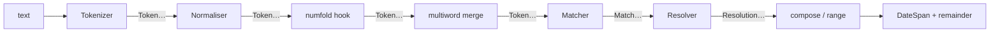

# Reading dates written by humans

The golden rule of this module: **turn "the 15th of Ramadan 1446" into a
span.** A person writes a date as a phrase — an ordinal, a month name from
whichever calendar they think in, a year — and `extract_timespan` turns
that phrase into the exact stretch of time it refers to.

```python
from chronologia import extract_timespan
from datetime import datetime

anchor = datetime(2024, 1, 1)   # what "now" means for relative phrases

span, remainder = extract_timespan("the 15th of Ramadan 1446", "en", anchor)
print(span.start_datetime.date())   # 2025-03-15
print(remainder)                    # the
```

The 15th of the Islamic month Ramadan in the Hijri year 1446 is the 15th
of March 2025 — computed, not looked up. The Islamic month name is read
straight from the English vocabulary; you do not have to tell the library
which calendar the phrase is in.

## What comes back

`extract_timespan(text, lang, anchor)` returns either `None` (nothing
matched) or a `(span, remainder)` pair:

- **`span`** is a [`DateSpan`](getting-started.md) — a half-open interval,
  *not* a single instant. A phrase names a stretch of time, and the span's
  **width** is that stretch. "June 2027" is a month wide; "3 pm" is a
  minute wide. This is the whole reason the function exists: it never
  invents a precision the speaker did not give.
- **`remainder`** is the leftover text the parse did not consume — the
  words around the date, so a caller can see what was and was not a date.

```python
from chronologia import extract_timespan
from datetime import datetime

june, _ = extract_timespan("june 2027", "en", datetime(2024, 1, 1))
print(june.width, "|", june.resolution.name)   # 30 days, 0:00:00 | MONTH

three_pm, _ = extract_timespan("3 pm", "en", datetime(2024, 1, 1))
print(three_pm.width)                           # 0:01:00
```

## The anchor

Relative phrases ("in three days", "next winter", "last tuesday") only mean
something relative to a moment. That moment is the `anchor` — pass the
caller's idea of "now"; it defaults to the wall clock.

```python
from chronologia import extract_timespan
from datetime import datetime

anchor = datetime(2017, 6, 27, 13, 4)   # a Tuesday

soon, _ = extract_timespan("in three days", "en", anchor)
print(soon.start_datetime)   # 2017-06-30 13:04:00

winter, _ = extract_timespan("next winter", "en", anchor)
print(winter.start_datetime.date())   # 2017-12-01
```

A range framed with "from A to B" or "between A and B" spans from the start
of the left endpoint to the end of the right one:

```python
from chronologia import extract_timespan
from datetime import datetime

span, _ = extract_timespan("from june 5th to june 12th", "en",
                           datetime(2017, 6, 27))
print(span.start_datetime.date(), "->", span.end_datetime.date())
# 2018-06-05 -> 2018-06-13
```

(June 5–12 is already past the June-27 anchor, so it rolls to the next
year — the engine prefers the future for bare calendar dates.)

## Deep time and other reckonings

Because the extractor resolves against the full reckoning core, it reaches
places `datetime` cannot. "66 million years ago" is a real span — its edges
are `AstroDate`, and `start_datetime` is simply `None` when a year falls
outside `datetime`'s range:

```python
from chronologia import extract_timespan
from datetime import datetime

span, _ = extract_timespan("66 million years ago", "en", datetime(2017, 6, 27))
print(span.start.year, span.resolution.name)   # -65998050 EPOCH_GEOLOGICAL
print(span.start_datetime)                      # None
```

## Seeing why a parse landed

`explain` opens a debug window over the same pipeline: the tokens, every
construction that matched, and which one won. It takes a compiled language
spec rather than a language code.

```python
from chronologia import explain
from chronologia.extract import load_lang_spec
from datetime import datetime

trace = explain("the 3rd week of june 1969", load_lang_spec("en"),
                datetime(2017, 6, 27))
print(len(trace.tokens), "tokens,", len(trace.winners), "winning construction")
# 7 tokens, 1 winning construction
```

`trace.report()` returns the whole thing as readable text — reach for it
when a phrase parses to something you did not expect. (One caveat, spelled
out under *Honest limits* below: `explain` runs the bare tokenizer, so it
does **not** apply the spelled-number fold — a trace of a phrase with
written-out numbers looks different from the real parse.)

## How it actually works

Think of the module as an **assembly line**. A sentence enters at one end
as a string; each station does one small, testable thing and hands its
output to the next; a `DateSpan` rolls off the other end. No station reaches
back, no station knows the language it is processing — the language is just
the parts bin the stations pull from.

That is the whole design in one sentence: **language is data, capability is
a resolver, and the two never entangle.** A new language adds `.voc` files
and a `lang.json`; a new capability adds a construction and a resolver
method. Neither touches the other, because the stations in between are
language-agnostic and the date math is capability-agnostic.



The core stations — `Tokenizer`, `TemporalNormaliser`, `ConstructionMatcher`,
`Resolver` — live in `chronologia/extract/` and are shared by every
language. `DateTimeEngine` is the facade that wires them together for one
language; `extract_timespan` is the public front door that adds the range
and composition passes on top.

### The values that flow down the line

Every value handed between stations is a **frozen dataclass** (from
`chronologia/extract/model.py`) — immutable, hashable, unit-testable in
isolation:

- **`Token`** — one lexical unit: `text` (the normalised form the matcher
  sees), `raw` (the original surface, kept so the remainder can be
  reconstructed), `index`, and for numbers `is_number` / `value`.
- **`SlotElement`** / **`SlotOrder`** — a compiled construction *order* such
  as `"MONTH DAY? YEAR?"`. Each element carries `name`, `optional` (the
  trailing `?`), and `is_slot` (an uppercase placeholder like `MONTH` vs. a
  lowercase literal connector like `of`).
- **`Match`** — one construction *claiming* a span of tokens: `construction`
  (its name), `span` (a half-open `(start, end)` token range), `slots` (the
  bound `name -> Token` map), and an optional `calendar` for non-Gregorian
  months.
- **`Resolution`** — a match's meaning: `value` (a `DateSpan`) plus
  `consumed` (the token indices it used). The `DateTimeResolution` tag is
  *derived* from the span's width, never stored separately.
- **`DateSpan`** — the end product, a half-open interval whose **width is
  the precision the writer gave** (see [getting started](getting-started.md)).

### Station by station

**1. Tokenizer** (`tokenizer.py`). Text → `tuple[Token]`. It lower-cases,
splits on a small regex, and keeps ISO literals (`2017-06-30`) and clock
literals (`15:30`) whole. Digit runs become numeric tokens; everything else
is language-neutral. Two per-language switches (`split_contractions`,
`ordinal_dot`) come from `lang.json`.

**2. Normaliser** (`normaliser.py`). `Token → Token`, closed-class
morphology only: a lemma map (`tygodni → tydzien`) then rule-based suffix
stripping. Numbers pass through untouched; only `text` changes, `raw` is
preserved.

**3. The numfold hook** (`numfold.py`, wired for English via `lang.json`'s
`hook`). The tokenizer only sees *digit* numbers, but people write "the
twenty fifth" and "the third week". This pass folds a maximal run of English
number-words into one digit token, so a `DAY`/`YEAR`/`ORD` slot binds the
same whether the writer typed `5` or `five`. It deliberately does **not**
fold `half`/`quarter` (those are clock fractions) or scale words like
`million` (those separate deep time from a plain offset).

**4. Multiword merge** (`DateTimeEngine._merge_multiword`). Vocabulary
surfaces that contain spaces ("bronze age") get glued back into a single
token, longest phrase first, so one slot can bind them.

You can watch the tokens that reach the matcher directly:

```python
from chronologia.extract import DateTimeEngine, load_lang_spec

engine = DateTimeEngine(load_lang_spec("en"))
toks = engine.tokenize("the third week of june")
print([t.text for t in toks])   # ['the', '3', 'week', 'of', 'june']
```

"third" was folded to `3`; the matcher never sees a spelled number.

**5. Matcher** (`matcher.py`). Tokens → non-overlapping `Match`es. Each
compiled construction order is tried at every start position by a plain
backtracking walk (`_walk`); optional slots try both present and skipped,
and the longest consumption wins. Binding a slot is a single lookup into the
language's typed vocab maps — `MONTH` checks `spec.months`, `DAY` checks
"is a number 1–31", and so on. There are no per-language regexes to debug,
only named slots. Then `_select` sorts every candidate by **longest span
first, ties broken by precedence, then by position**, and greedily takes
non-overlapping winners.

```python
from chronologia.extract import DateTimeEngine, load_lang_spec

engine = DateTimeEngine(load_lang_spec("en"))
matches = engine.matcher.match(engine.tokenize("june 5th 2027"))
for m in matches:
    print(m.construction, m.span, {k: v.text for k, v in m.slots.items()})
# calendar_date (0, 3) {'MONTH': 'june', 'DAY': '5', 'YEAR': '2027'}
```

**6. Resolver** (`resolver.py`). `Match` + `anchor` → `Resolution`. This is
where *all* the date math lives, once, engine-side. Each construction has a
`_resolve_<name>` method; the sign of a "N units ago" offset is read from
the marker's declared `Direction`, so a language cannot get ago/hence
backwards because it never writes the sign. An impossible date never raises
— `resolve` returns `None` and the construction simply did not fire.

### One phrase, end to end

Take **"the meeting is on the fifth of june at half past nine"** with the
anchor `2024-01-01`, and follow it down the line.

First, tokenizing (normalise → **fold** → merge). "fifth" folds to `5`,
"nine" folds to `9`; "half" and "past" stay as themselves (clock words):

```python
from datetime import datetime
from chronologia.extract import DateTimeEngine, load_lang_spec

engine = DateTimeEngine(load_lang_spec("en"))
sentence = "the meeting is on the fifth of june at half past nine"
toks = engine.tokenize(sentence)
print([(t.index, t.text) for t in toks])
# [(0,'the'),(1,'meeting'),(2,'is'),(3,'on'),(4,'the'),(5,'5'),
#  (6,'of'),(7,'june'),(8,'at'),(9,'half'),(10,'past'),(11,'9')]
```

The matcher finds **two** non-overlapping constructions — a date and a
clock — each claiming only the tokens it can bind:

```python
for m in engine.matcher.match(toks):
    print(m.construction, m.span, {k: v.text for k, v in m.slots.items()})
# calendar_date (5, 8) {'DAY': '5', 'MONTH': 'june'}
# clock_time    (9, 12) {'FRACTION': 'half', 'CLOCKDIR': 'past', 'HOUR': '9'}
```

`calendar_date` binds `DAY of MONTH` (tokens 5–7) and resolves to the
day-wide span `2024-06-05`. `clock_time` binds `FRACTION CLOCKDIR HOUR`
("half past 9") and resolves to the minute-wide span `09:30`. The words
`the meeting is on the` and `at` bind nothing.

Now the **composition pass** in `extract_timespan` notices exactly one lone
date and one lone clock in the same text and folds them together —
intersecting the day the date names with the time-of-day the clock names
(`compose_date_clock`): the calendar day of June 5th, at 09:30:

```python
from chronologia import extract_timespan

span, remainder = extract_timespan(sentence, "en", datetime(2024, 1, 1))
print(span.start_datetime, "->", span.end_datetime)
# 2024-06-05 09:30:00 -> 2024-06-05 09:31:00
print(span.width)        # 0:01:00   (a minute wide — the clock's precision)
print(repr(remainder))   # 'the meeting is on the at'
```

The result is the minute-wide span at half past nine on the fifth of June,
and the remainder is every token no construction consumed. (`remainder`
carries the connective words `on`, `the`, `at` too — the engine only
removes what a construction actually bound, not the natural-language glue
around it.)

One honest wrinkle worth seeing: `explain` runs the **bare** tokenizer, with
no fold, so its trace of this sentence looks nothing like the real parse —
"fifth" stays a word, so no `DAY` binds and only a bare-month `calendar_date`
survives:

```python
from chronologia import explain
from chronologia.extract import load_lang_spec

trace = explain(sentence, load_lang_spec("en"), datetime(2024, 1, 1))
print(len(trace.winners), "winner(s)")   # 1 winner(s)
print(trace.winners[0].match.construction, trace.winners[0].match.slots.keys())
# calendar_date dict_keys(['MONTH'])
```

To see the real, folded matcher decisions, match the folded tokens directly
(as the two matcher blocks above do). `explain` is still the right tool for
digit-form phrases and for understanding *why a candidate lost*.

### Precedence: the verbatim order

Precedence is **not** the first tie-breaker — span length is. Two candidates
only reach the precedence comparison when they cover an **equally long**
overlapping span. The order lives in `PRECEDENCE` in `compiler.py` (lower
rank = higher priority); here it is, verbatim, with a note on the pairs that
matter:

| rank | constructions |
|------|---------------|
| 0 | `era_date`, `named_period`, `deep_time` |
| 1 | `era_bc`, `era_ad`, `era_bp`, `regnal_date`, `roman_date`, `military_time`, `hebrew_new_year` |
| 2 | `scoped_ordinal`, `month_fuzzy`, `half_period`, `month_day_ref`, `decade_ref` |
| 3 | `season_ref` |
| 4 | `iso_date` |
| 5 | `reckoned_date`, `nongregorian_date` |
| 6 | `calendar_date`, `subdivision_time`, `year_ref` |
| 7 | `clock_time` |
| 8 | `weekday_ref`, `cycle_ref`, `named_day_after`, `named_day_before`, `weekday_offset` |
| 9 | `relative_offset` |
| 10 | `named_day` |

Why the adjacent pairs are ordered the way they are:

- **`military_time` (1) over `scoped_ordinal` (2)** — "1500 hours" would
  otherwise read as an "N-th hour" scoped ordinal; military time carries the
  more specific `hours` vocabulary and wins the same-span tie.
- **`regnal_date` / `roman_date` (1) over the scoped/calendar families** —
  they carry the most specific vocabulary (era names, `Kalends`), so a name
  that also looks like a generic date resolves as the special calendar.
- **`decade_ref` (2) over `year_ref` (6)** — "the 1990s" carries the plural
  marker a bare year lacks, so the same digits read as a decade, not a year.
- **`reckoned_date` (5) over `calendar_date` (6)** — a non-Gregorian month
  name is more specific than a Gregorian one covering the same tokens.
- **`year_ref` (6) just below `calendar_date`** — a bare year is the least
  specific calendar reference; anything more specific that also covers the
  digits must win.

You can watch a real same-span precedence decision — here `military_time`
beats `scoped_ordinal` on the identical span `(0, 2)`:

```python
from chronologia import explain
from chronologia.extract import load_lang_spec

print(explain("1500 hours", load_lang_spec("en"), datetime(2024, 1, 1)).report())
# ... MATCH military_time span=(0, 2) ...
# ... lost  scoped_ordinal span=(0, 2): overlaps military_time span=(0, 2) of higher precedence
```

**A caveat the code makes honest.** Precedence only settles *equal-length*
overlaps. It does **not** reach across differently-sized spans, and it cannot
make a construction match tokens it has no order for. "3rd century BC" is the
classic trap: there is no construction spanning `century` *and* `bc`, so
`scoped_ordinal` claims "3rd century" and `bc` is simply left in the
remainder — the phrase resolves to the third century **AD**, not BC:

```python
from chronologia import extract_timespan

span, remainder = extract_timespan("3rd century bc", "en", datetime(2024, 1, 1))
print(span.start.year, span.end.year, "|", repr(remainder))
# 200 300 | 'bc'
```

So `era_bc` outranking `scoped_ordinal` in the table does *not* rescue this
phrase — the table only decides ties, and these two never tie. Getting "BC"
to bind here would need a construction whose order actually spans the scope
word and the era word; the ranking cannot substitute for a missing rule.

### The assembly passes: ranges and composition

Two behaviours live in `extract/__init__.py`, **above** the token grammar,
because they compose *whole sub-parses* rather than bind tokens:

- **Ranges** (`_extract_range`). "from A to B" / "between A and B" is
  detected by a surface regex, then **each endpoint is parsed independently**
  by a full recursive `extract_timespan`, and the two spans are stitched
  (left edge of A to right edge of B, rolling B forward a day or a week if it
  wraps past A). This only fires when both sides parse on their own, which is
  what keeps "quarter to five" (a clock, not a range) from being read as
  "quarter" → "five".
- **Date ∩ clock composition** (the pass you saw in the worked trace). When a
  text yields exactly one lone date and one lone clock, they fold into a
  single minute-wide span on that day.

These live above the grammar on purpose: a construction's job is to bind a
contiguous run of tokens to one meaning. A range framing and a date-plus-time
pairing each combine *two independent meanings*, which is not something a
single token-span construction can express. Keeping them out of the matcher
keeps every construction a local, testable token rule, and keeps the
cross-construction logic in one readable place.

### Adding a capability vs. adding a language

The two extension paths never cross:

- **Add a language** — pure data, no Python. Create
  `chronologia/locale/<code>/`, translate the `.voc` surface forms, write a
  `lang.json` listing the constructions the language enables and its calendar
  conventions. The stations already know what to do with the vocab. This is
  the path detailed in *[How a language works — and how to add one](#how-a-language-works--and-how-to-add-one)*
  below.
- **Add a capability** — a new *construction*. Give it an entry in
  `PRECEDENCE` (`compiler.py`), let each language declare its `orders` and any
  new slot vocabulary, teach `_bind` (`matcher.py`) any new slot names, and
  write one `_resolve_<name>` method (`resolver.py`) for the date math. The
  capability then works for *every* language that lists it — the resolver is
  language-agnostic.

Concretely: teaching the engine a new *word for June* is a one-line
vocabulary edit; teaching it to understand *"the Nth quarter of YEAR"* is a
new construction (order + slot + resolver), available to English, Polish, and
every other locale the moment they list it.

### Honest limits

The matcher is a clean, local token-span grammar, and that buys real
limitations, stated plainly:

- **No crossing or discontiguous spans.** A construction binds one
  *contiguous* run of tokens. A meaning split across a gap ("the 3rd … of the
  months I mentioned") or interleaved with another construction cannot be
  expressed as a single `Match`. The "3rd century BC" trap above is this
  limit in miniature.
- **No scattered sets.** "the first and third Mondays" names a *set* of days;
  the engine resolves single spans, not enumerated collections.
- **Single-winner selection resolves ambiguity silently.** `_select` takes
  the longest, highest-precedence, earliest candidate and moves on — a
  genuinely ambiguous phrase quietly yields one reading with no signal that
  another was plausible. `explain` will *show* you the losers and why they
  lost, but `extract_timespan` returns only the winner. A future
  `CandidateSet`-style return (surfacing ranked alternatives instead of a
  lone span) is the natural direction here; it is **not** promised, and today
  the contract is one span or `None`.

## How a language works — and how to add one

Every language is **data only**. There is no per-language code: the engine
core (tokenizer, normaliser, compiler, matcher, resolver) is shared, and a
language is a directory under `chronologia/locale/<code>/`:

- **`*.voc` vocabulary files** — one *slot* per file, one surface form per
  line. The filename is the slot. `month_6.voc` lists the words for the
  sixth Gregorian month (`june`, `jun`); `weekday_0.voc` the words for
  Monday; `unit_day.voc` the words meaning "day"; `marker_next.voc` the
  words meaning "next". Non-Gregorian months use
  `month_<calendar>_<n>.voc` (e.g. `month_islamic_civil_9.voc` is Ramadan),
  where `<calendar>` must be a calendar the core knows.
- **`lang.json`** — the one stanza per language: tokenizer options, the
  constructions this language enables, calendar conventions (day/month
  order, hemisphere, week start), and an optional `hook`.

The vocabulary files are loaded through **ovos-spec-tools**, the shared
`/locale` convention. Spelled-out numbers ("twenty fifth", "three") are
folded to digits by **ovos-number-parser** before matching, so a slot binds
the same whether the writer typed `5` or `five`.

To add a language, create `chronologia/locale/<code>/`, translate the `.voc`
surface forms, and write a `lang.json` that sets the conventions and lists
the constructions the language supports. Start by copying the closest
existing language and replacing the surfaces — no Python required.

## The testing doctrine: a corpus first

The contract this module is held to is not "the internals do X"; it is
"a sentence a human would actually say resolves to the right span." So the
tests are a **corpus** — hundreds of natural phrases, each asserting the
exact span, with the expected value derived by hand or by independent date
arithmetic that never touches the engine. A test never pins the engine's
own output as the expected answer (that would only prove the code equals
itself). When you add a language or a construction, add corpus cases in the
same spirit — real sentences, and cases written to *break* the parse, not
just the happy path.

## The corpus convention (and the cross-language parity contract)

A language opts into span-native extraction by shipping a **corpus package**
at `test/nl_corpus_<code>/` — a directory of parametrised `test_nl_*.py`
modules, each a real sentence asserting the exact span, expected values
derived by hand. `test/test_language_parity.py` is the structural guard over
that convention. It is **discovery-based**: it finds corpus packages by
directory name, with no hardcoded language list, so a new language lands its
package and is validated automatically — parallel branches never collide on
that file. It enforces three things per discovered corpus:

- the corpus backs a real `locale/<code>/lang.json`;
- the corpus collects **at least 100 cases**;
- every non-reference corpus ships a **semantic-parity block**
  (`nl_corpus_<code>/parity.py`, a `PARITY` list of `(<code> phrase, English
  phrase)` pairs) whose every pair resolves to the **same span** in that
  language as in the English reference corpus.

The reference language `en` is exempt from the parity-block requirement — it
*is* the reference the others are measured against. Languages whose locale
predates the convention simply have no package yet; adding one opts them in.

## Speaking dates back out

This module *reads* dates. To *say* one back to a user — voice-facing
formatting, "nice" spoken phrasings, session and dialogue glue —
[ovos-date-parser](https://github.com/OpenVoiceOS/ovos-date-parser) builds
on this library and adds exactly that layer.
